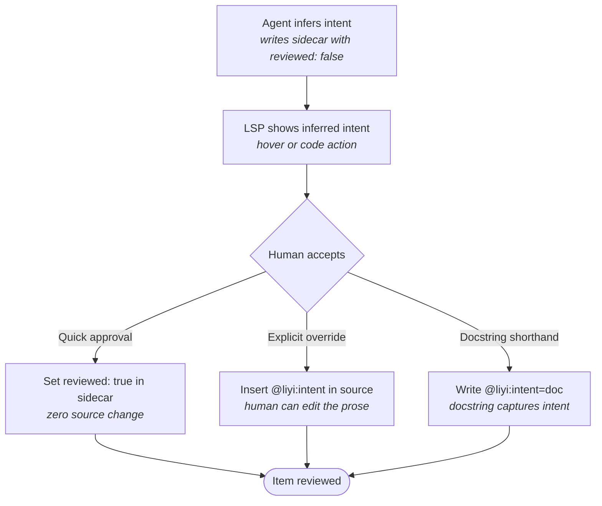
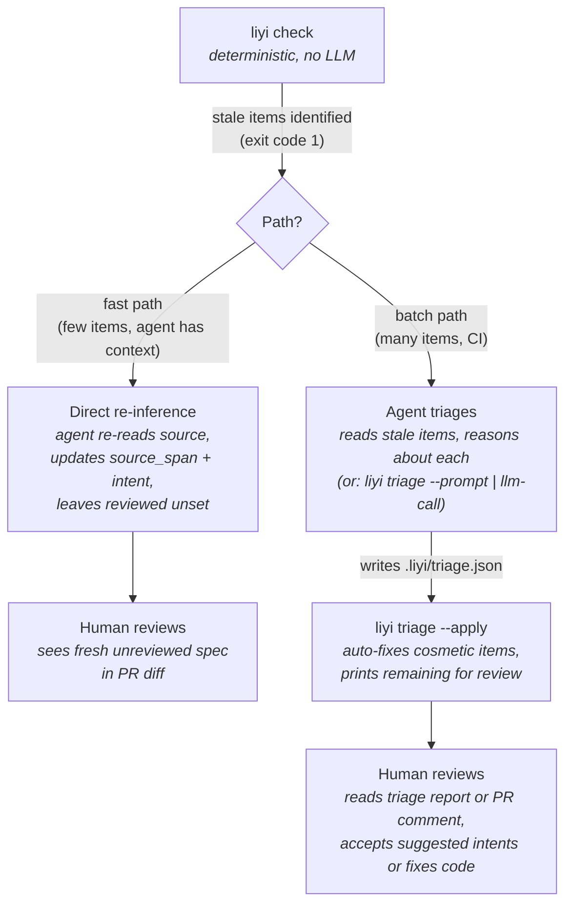
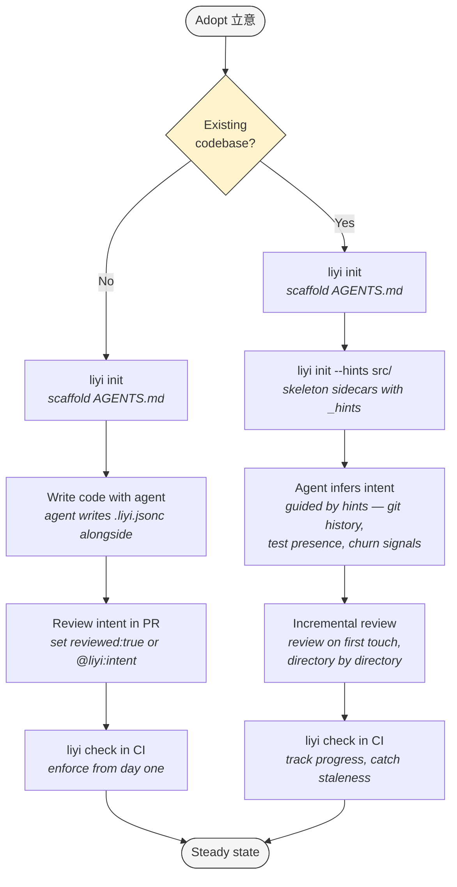

# 立意 (Lìyì) — Design v8.11

Establish intent before execution · 2026-03-12

---

## The Idea

AI writes your code. You can't read it all. 立意 captures the intent that exists in people's heads — business requirements, domain invariants, implicit assumptions — and makes it persistent, structured, and adversarially testable. The tool doesn't compete with what your framework already declares; it captures what your framework *can't*.

AI agents write most code. Humans review it but can't read it all. Intent is ephemeral — it lives in prompts, PR descriptions, Slack threads, context windows. When a different agent or human touches the code six months later, the intent is gone. The code is a fact; what it was *meant* to do is a memory.

Frameworks already declare some intent: middleware stacks declare auth and rate-limiting, type systems declare structural constraints, decorators declare routing. 立意 targets the layer that no framework captures: *what the business logic should do*, *why a domain constraint exists*, *what assumptions the original author held but never wrote down*. This is the 20% of code that carries 80% of the risk — and where review compression matters most.

立意 is the practice of making this intent explicit and persistent — written down, reviewable, challengeable, and durable across sessions, context windows, and team turnover:

1. An agent reads existing code and **infers** what it *should* do — not what it *does*. Or: a human (or agent) writes down what code *should* do before it exists — a **requirement**.
2. Either way, intent is persisted in files that survive across sessions, agents, and team changes.
3. A human reviews the intent — a few lines of inferred spec or a requirement block — instead of the full implementation. Per item, the review surface is typically ~10% of the code surface. At scale, hierarchical requirements compress this further (see *Review scaling and complexity* below).
4. Optionally, the reviewer **challenges** the intent — a second model verifies code against intent, or intent against requirement, and reports divergence. On-demand, zero commitment.
5. A CI linter verifies that intents exist, are reviewed, and aren't stale — and that requirements and implementations haven't diverged.
6. Optionally, a second agent reads the reviewed intent and generates adversarial tests designed to break the code — different model, different blind spots.

Intent flows in two directions. **Descriptive**: an agent infers what existing code should do, a human reviews it, and the reviewed spec becomes authoritative. **Prescriptive**: a human (or agent) states a requirement before or alongside coding, and code must satisfy it. Both directions produce the same artifacts, use the same linter, and feed the same challenge and adversarial testing pipeline.

Persistence is the foundation. **Human review is the primary value that persistence enables** — a few lines of NL intent instead of the full implementation. Challenge is a force multiplier on that review: it lets a reviewer verify intent without reading all the code. Adversarial testing is the payoff — but even without it, persistent reviewed intent is valuable on its own. Without review, the system degenerates into auto-updating specs (which is what optimistic tools do); the human's judgment is what makes intent authoritative rather than merely descriptive.

The agent instructions are the protocol. The CI linter is what makes it deterministic.

---

## The Two Pillars: First-Class Requirements and First-Class Intent

立意 promotes two kinds of knowledge from informal prose to **first-class artifacts** — named, hashed, tracked by CI, and composable through dependency edges. They participate in the development toolchain the same way source code does: they have identity, they go stale, and they break the build when they drift.

| | **Requirement** (prescriptive) | **Intent** (descriptive) |
|---|---|---|
| **What it captures** | What code *must* satisfy | What existing code *should* do |
| **Direction** | Spec → code (stated before or alongside) | Code → spec (inferred after the fact) |
| **Who writes it** | Human (or agent) asserts | Agent infers, human reviews |
| **Where it lives** | Anywhere the linter walks — source comments, Markdown, doc comments | `.liyi.jsonc` sidecar, co-located with source |
| **Marker** | `@liyi:requirement <name>` | `@liyi:intent` (source) or `"intent"` field (sidecar) |
| **Staleness trigger** | Requirement prose changes → all `related` items flagged | Source code at `source_span` changes |
| **Review semantics** | Writing the requirement *is* the assertion — VCS provenance suffices | "The agent got it right" (approve) or "here's what I meant" (override) |
| **Ownership** | The authority that owns the invariant | The team that writes the code |
| **Locality** | Can be centralized (shared via submodule) | Must be co-located (same repo as source) |
| **Schema key** | `"requirement"` | `"item"` + `"intent"` |

**What makes them first-class.** Comments, ADRs, and Confluence pages are persistent but not first-class — no tool hashes them, no CI detects when they drift from code, no dependency graph connects them to implementations. First-class means the properties that source code enjoys:

- **Named** — requirements have explicit names; intents have item + span identity
- **Content-addressed** — SHA-256 hashes detect any change, no matter how small
- **Tracked by CI** — `liyi check` fails the build on staleness, just as a compiler fails on type errors
- **Composable** — `@liyi:related` edges form a dependency graph between requirements and the code that satisfies them

**The novelty is asymmetric.** First-class requirements exist in requirements engineering (DOORS, ReqIF, Polarion). First-class *inferred intent* alongside code does not. No existing tool takes an agent's inference of what code should do, persists it as a hashed artifact, and subjects it to deterministic staleness tracking. That is the new artifact type 立意 introduces.

### When to use which — rules of thumb

| Situation | Use |
|---|---|
| You're reading existing code and writing down what it should do | **Intent** |
| You're stating a business rule before (or independent of) any implementation | **Requirement** |
| The statement is owned by the team that writes the code | **Intent** |
| The statement is owned by someone who doesn't write the implementation (PM, architect, compliance) | **Requirement** |
| It applies to one function or struct | **Intent** |
| It applies across multiple items, modules, or repos | **Requirement** (with `@liyi:related` edges) |
| It needs to survive even if the implementation is rewritten from scratch | **Requirement** |
| It describes *this specific implementation's* contract | **Intent** |

### They work together

A requirement states *what must hold*. An intent describes *how this code satisfies it*. The `@liyi:related` edge connects them:

```
@liyi:requirement no-double-charge
─── "Never charge a customer twice for the same order"

            │ related edge
            ▼

@liyi:intent "Check idempotency key before charging.
Return cached result if key exists."
fn charge_order(...)
```

The requirement is prescriptive and stable — it changes when the business rule changes. The intent is descriptive and tracks the implementation — it changes when the code changes. When the requirement changes, all related intents are flagged. When the code changes, only that item's intent is flagged. The two layers give you both top-down traceability and bottom-up staleness detection.

---

## The Name

立意 (lìyì) — "establish intent" — is a concept taught in Chinese elementary writing education (语文课). Before composing an essay, every student learns to 立意: decide the central idea, the purpose, the thesis — before writing a single sentence. 意在笔先: intent before brush.

The concept roots in calligraphy and painting (画论), where 立意 is the non-negotiable first step of any creative work — the artist decides what the piece is *meant to invoke* before executing it — and extends into literary criticism and composition pedagogy. Literary critics name the complementary motion: 文随意转 — the writing follows as intent turns. When purpose evolves, the work adapts to track it.

There is a deliberate irony. Literary 文随意转 celebrates intent's fluidity — the transformation *is* the creative act. The engineering tool treats that same motion as staleness: it detects that intent turned, flags the divergence, and asks a human to adjudicate. We capture the subset of intent where durability outranks fluidity; the rest belongs to genres where betraying intent is growth.

English has analogues — "thesis statement," "controlling idea," "premise" — but none that name the act of *deciding intent as a prerequisite step*. We transliterate rather than translate because no English term carries the same connotation: intent first, everything else follows.

In the classroom, 立意 works in both directions. Before writing, the teacher challenges the thesis: 太浅了 (too shallow), 偏题了 (off-topic), 太俗了 (too cliché) — the student refines before composing. After writing, the teacher critiques the finished piece against its declared intent: the verdict is appraisal (premise well executed) or disagreement (the essay wandered from its thesis). The software convention preserves both phases: challenge intent before execution, then verify the result against it afterward.

It occurred to the designer that 立意, a practice every Chinese student learns before age ten, names exactly the gap described above: intent is ephemeral in AI-assisted development, and the missing step is establishing it before execution. The name is recognition, not metaphor — the practice already existed; the software convention formalizes it.

---

## Origin

The three convictions at 立意's core — requirements as first-class tracked artifacts, natural-language intent persisted alongside code, and generated results frozen with their generative context — trace to a thought experiment called PMLang (2021–2023). Working in a Go shop writing billing and payment systems, the designer wanted product managers to write executable domain logic directly: PMs and programmers would agree on a core set of business-logic primitives, programmers would implement pattern matching and materialization, and NL prose following the Gherkin pattern would become executable, testable code. First-class requirement blocks captured what the business needed; first-class prompt blocks captured the NL instruction; frozen inference preserved the (then-scarce) correct AI output alongside the prompt that produced it.

PMLang was never built, and, by the time the designer began drafting 算言 — a verification-first programming language explored over five days of intensive multi-model adversarial review (March 2–7, 2026) — the name and specific design decisions had been forgotten. The motivations survived as latent premises: every 算言 iteration, from the full dependent-type PL (v1) through Rust proc macros (v4), a JSON interchange format (v5), and an adversarial CLI (v6), independently re-derived first-class requirements, intent persistence, and frozen-inference provenance. 立意 is what remained after the language, the type system, and the execution model were stripped away. The capability inversion between 2023 and 2026 — AI going from unreliable (freeze results because regeneration is expensive) to prolific (track results because overwriting is easy) — transformed the same artifact from trophy case to staleness sensor, but the shape was already there.

---

## File Layout

Two levels of intent, two formats:

```
src/billing/
├── README.md                  ← has a 立意 section
├── money.rs                   ← source
├── money.rs.liyi.jsonc        ← item-level intents (JSONC, machine-friendly)
├── orders.rs
├── orders.rs.liyi.jsonc
└── .liyiignore                 ← file-level exclusions (gitignore syntax)
```

### `.liyi/` directory

Tool-generated artifacts live in a `.liyi/` directory at the repository root:

```
.liyi/
├── triage.json                ← latest triage report (agent-produced, liyi-validated)
└── (future: cache files, intermediate state)
```

`.liyi/` is `.gitignore`'d by default — the triage report is derived from sidecars + source + LLM, not a source of truth. Teams that want audit trails can commit it or archive it as a CI build artifact. This follows the same pattern as `.mypy_cache/`, `.ruff_cache/`, or `.pytest_cache/` — a project-level workspace for tool-generated artifacts that shouldn't pollute the source tree.

The `.liyi/` directory is distinct from `.liyi.jsonc` sidecar files (which are co-located with source, committed, and are source of truth). Sidecars are durable; `.liyi/` contents are ephemeral.

### Scope: per-checkout

立意 operates on one checkout. The linter walks one tree; the agent reads one codebase; specs reference repo-relative paths.

This scope constraint has different implications for the two pillars (see *The Two Pillars* above). The tool treats both uniformly (same schema, same hash-based staleness), but their locality rules differ — intents must be co-located with code; requirements can be centralized.

- **Monorepo**: both intents and requirements flow freely. The linter walks the whole tree. Module-level invariants can span directories. The intent dependency graph (future) resolves to local paths.
- **Polyrepo**: item-level intents stop at the repo boundary — each repo specs its own code, including its assumptions about dependencies (“I call `verify_token` and expect it to return `Claims` or error”). Requirements, however, can be shared across repos via the centralized requirements pattern described below.

Cross-repo intent *sharing* can be useful context — an agent reading a dependency’s shipped `.liyi.jsonc` from a package tree gathers context to write its own specs — but it’s not a transitive obligation. The intent informs; it doesn’t cascade. No mechanism for cross-repo intent enforcement is planned.

**Why item-level intents must stay co-located.** It’s tempting to keep all specs in one repository — a single place to review intent across the organization, decoupled from implementation repos. For item-level intents, this doesn’t work, and the reasons are structural:

- **Staleness requires co-location.** An item spec’s `source_span` and `source_hash` reference lines in the *source file*. If the spec lives in a different repo, the linter can’t hash the source. Cross-repo file access is a security boundary, not a missing feature.
- **PR review flow requires co-location.** When a developer changes `money.rs`, the co-located `money.rs.liyi.jsonc` diff appears in the same PR. Separating item specs into another repo means code changes silently leave specs behind — staleness becomes the norm, not the exception.
- **It fights Conway’s law.** A centralized item-spec repo implies centralized authority over local implementation knowledge. But the agent or developer working on the code understands what the function should do. Separating that knowledge from the code re-creates the communication gap Conway’s law says produces bad software.

**Requirements are different.** A requirement’s `source_span` references *its own prose*, not implementation code. Its staleness is tracked via hash comparison on `related` edges — downstream items record the requirement’s hash and are flagged when it changes. The requirement doesn’t need to live next to the code that satisfies it; it needs to be readable by the linter (i.e., present in the checkout) and owned by the authority that defines the invariant.

System-level constraints — “all inter-service communication uses mTLS,” “no service charges a customer twice for the same order” — are not just ADRs. They are first-class `@liyi:requirement` candidates: hash-tracked, linked to implementations via `@liyi:related`, with deterministic staleness detection when the requirement changes. Treating them as untracked prose throws away the requirement mechanism the design provides.

#### Centralized requirements via submodule

For polyrepo organizations, the recommended pattern for cross-cutting requirements is a **dedicated requirements repository** consumed by downstream repos as a git submodule (or equivalent content dependency mechanism):

```
org-requirements/              ← standalone repo, owned by platform/architecture team
├── billing/
│   └── invariants.md          ← @liyi:requirement blocks
├── security/
│   └── invariants.md
└── data/
    └── invariants.md

service-a/                     ← downstream repo
├── requirements/              ← git submodule → org-requirements
│   ├── billing/
│   │   └── invariants.md
│   └── security/
│       └── invariants.md
├── src/
│   ├── payments.rs
│   ├── payments.rs.liyi.jsonc ← @liyi:related no-double-charge
│   └── ...
└── .gitmodules
```

This works with the existing mechanism, no schema or linter changes required:

- The submodule directory is part of the checkout. The linter’s file walk discovers `requirements/billing/invariants.md` and its `@liyi:requirement` markers. Paths are repo-relative (`requirements/billing/invariants.md`), which is how they appear in sidecars.
- `@liyi:related no-double-charge` in `payments.rs.liyi.jsonc` resolves to the requirement in the submodule path. The linter hashes the requirement text and compares against the recorded hash — standard staleness detection.
- When the requirements repo is updated, downstream repos update their submodule pin. The pin update appears in the PR diff. `liyi check` detects hash mismatches on `related` edges and flags affected items — the same transitive staleness mechanism that works for in-repo requirements.
- `git blame` on the requirements repo gives provenance for who wrote the requirement and when. `git log` on the submodule pin in the downstream repo gives adoption history.

**This is Conway-correct.** The ownership split mirrors *The Two Pillars*: the authority to define “no service charges a customer twice” lives at the organizational level (requirement), not with any single service team. Each downstream team retains ownership of their item-level intents (co-located with their code) and their `@liyi:related` edges (declaring which requirements their code participates in). Both are tracked by the same linter.

**When to use this pattern:**

- Polyrepo organizations with cross-cutting invariants that multiple services must satisfy
- Regulated industries where requirement provenance and traceability are audited
- Teams that already manage shared ADRs, API contracts, or compliance rules centrally

**When not to use this pattern:** Monorepos (requirements already flow freely), single-repo projects, or teams whose requirements are all local to one service.

**Residual gap.** Even with shared requirements, there is no mechanism to verify that a downstream repo *has* `@liyi:related` edges for requirements it should satisfy — only that the edges it *does* have are checked for staleness. Discovering which requirements apply to which repos is an organizational process, not a linter feature. Complementary tools (contract testing, API schema validation, integration tests) address parts of this from a different angle; 立意 doesn’t replace them and isn’t replaced by them.

### Module-level: `@liyi:module` marker

Module-level intent is prose describing cross-function invariants. It can live anywhere — Markdown files, source-level doc comments, wherever the team already writes module documentation. The `@liyi:module` marker is the universal signal the linter keys on.

#### In a `README.md` (or any Markdown file)

```markdown
# Billing

This module handles monetary operations.

## 立意
<!-- @liyi:module -->

All monetary amounts carry their currency. No function in this module
silently converts between currencies — mismatches must be explicit errors.
Precision must never be lost through rounding without an explicit
rounding parameter.

## Usage
...
```

The heading makes the section discoverable in the rendered page and GitHub's outline sidebar. The `<!-- @liyi:module -->` comment marks the block for the linter. Both are present: the heading is for humans and agents, the marker is for machines.

Preferred heading text, in order:

1. **`立意`** — the project's own term. Use it if your team can input hanzi and finds it acceptable.
2. **`Liyi`** — if you agree with the Chinese framing but lack a Chinese IME or hanzi support.
3. **`Intent`** (or your own language) — the heading is for humans; use whatever word your team understands.

The linter never inspects the heading. It only matches `@liyi:module`.

**Convention: use the doc markup language's comment syntax for the marker.** Most doc rendering pipelines go through a markup language — Markdown, reStructuredText, etc. — and each has a native comment syntax that is invisible in rendered output. Use that syntax so the marker never leaks into documentation.

The linter matches the literal string `@liyi:module` — it doesn't care about surrounding syntax.

#### In a dedicated `LIYI.md`

```markdown
# 立意
<!-- @liyi:module -->

Currency operations for the billing system.

All monetary amounts carry their currency. No function in this module
silently converts between currencies — mismatches must be explicit errors.
Precision must never be lost through rounding without an explicit
rounding parameter.
```

A heading is still required (most Markdown linters enforce it).

#### In source code (when the host language has module-level doc conventions)

Doc comments are rendered through a markup language. Use that markup's comment syntax for the marker, just as we use HTML comments in Markdown files.

Rust — top of `mod.rs` or `lib.rs` (rustdoc renders Markdown):

```rust
//! Currency operations for the billing system.
//!
//! <!-- @liyi:module -->
//! All monetary amounts carry their currency. No function
//! in this module silently converts between currencies — mismatches must
//! be explicit errors. Precision must never be lost through rounding
//! without an explicit rounding parameter.
```

Python/Sphinx — module docstring (Sphinx renders reStructuredText):

```python
"""Currency operations for the billing system.

.. @liyi:module
   All monetary amounts carry their currency. No function
   in this module silently converts between currencies — mismatches must
   be explicit errors. Precision must never be lost through rounding
   without an explicit rounding parameter.
"""
```

`.. @liyi:module` is a reST comment — invisible in Sphinx output. The indented body is the intent; it ends at the first un-indented line (reST's own block structure).

Python/mkdocstrings — module docstring (mkdocstrings renders Markdown):

```python
"""Currency operations for the billing system.

<!-- @liyi:module -->
All monetary amounts carry their currency. No function
in this module silently converts between currencies — mismatches must
be explicit errors. Precision must never be lost through rounding
without an explicit rounding parameter.
"""
```

Go — `doc.go` (godoc is plain text — no markup comment syntax available):

```go
// Package billing handles currency operations.
//
// # 立意 @liyi:module
//
// All monetary amounts carry their currency. No function
// in this package silently converts between currencies — mismatches must
// be explicit errors. Precision must never be lost through rounding
// without an explicit rounding parameter.
package billing
```

Go 1.19+ doc comments support `#` headings. Since godoc has no markup comment syntax, the marker is visible in rendered output. Embedding it in the heading (`# 立意 @liyi:module`) gives it structure rather than leaving it as a stray annotation.

#### Convention summary

| Location | Markup | Marker syntax |
|---|---|---|
| `.md` files (README, LIYI.md, etc.) | Markdown | `<!-- @liyi:module -->` — has a 立意 section |
| `mod.rs`, `lib.rs` (rustdoc) | Markdown | `//! <!-- @liyi:module -->` |
| Python docstring (Sphinx) | reST | `.. @liyi:module` |
| Python docstring (mkdocstrings) | Markdown | `<!-- @liyi:module -->` |
| `doc.go` (godoc) | plain text | `// # 立意 @liyi:module` (visible, in heading) |

The `@liyi:module` string is the only thing the linter looks for. Everything else — heading style, file choice, comment syntax — is team preference.

The linter only checks for the *presence* of `@liyi:module` in a directory's files. It does not parse or consume the intent prose — that text is for humans, agents, and code review; the linter just confirms it exists. Post-MVP, a closing `/@liyi:module` tag may be supported for mechanical extraction of module intent prose from long files; the 0.1 linter does not look for it.

- Optional. Not every directory needs one. The agent infers it when cross-function invariants are apparent.
- The linter can report directories that have `.liyi.jsonc` files but no `@liyi:module` marker (informational, not a failure by default).

### Item-level: `.liyi.jsonc`

"Item" rather than "function" — because `source_span` can point to a function, a struct with derive attributes, a macro invocation, a decorated endpoint, or any other intent site. The term follows Rust specification prior art, where "item" is anything that can appear at module level.

<!-- @liyi:requirement liyi-sidecar-naming-convention -->
**Naming convention.** The sidecar filename is the source filename with `.liyi.jsonc` appended: `money.rs` → `money.rs.liyi.jsonc`. Always append to the full filename, never strip the extension. This avoids ambiguity when files share a stem but differ in extension (`money.rs` and `money.py` would otherwise both claim `money.liyi.jsonc`). The rule is mechanical: one source file, one sidecar, derivable by concatenation.
<!-- @liyi:end-requirement liyi-sidecar-naming-convention -->

One per source file, co-located:

The `source` path is relative to the repository root — the same path you'd pass to `git show`. The JSONC header comment is informational (the linter ignores it).

```jsonc
// Generated by 立意 protocol — agent: claude-opus-4, 2026-03-05
{
  "version": "0.1",
  "source": "src/billing/money.rs",
  "specs": [
    {
      "item": "add_money",
      "intent": "Add two monetary amounts of the same currency. Must be commutative. Must reject mismatched currencies with an error, not a panic. Must not overflow silently.",
      "source_span": [42, 58],
      "tree_path": "fn::add_money",
      "confidence": 0.94
    },
    {
      "item": "convert_currency",
      "intent": "=doc",
      "source_span": [60, 85],
      "tree_path": "fn::convert_currency",
      "confidence": 0.87
    }
  ]
}
```

`source_hash`, `source_anchor`, and `tree_path` are tool-managed — the agent writes only `source_span` and the tool fills in the rest (see *Per-item staleness* and *Structural identity via `tree_path`* below). Agents MAY write `tree_path` if they can infer the AST path, but the tool will overwrite it with the canonical form on the next `liyi check --fix`. `"intent": "=doc"` is a reserved sentinel meaning "the docstring already captures intent" — the agent uses it when the source docstring contains behavioral requirements (constraints, error conditions, properties), not just a functional summary (see *`"=doc"` in the sidecar* below).

<!-- @liyi:requirement version-field-required -->
`"version"` is required. The linter checks it and rejects unknown versions. This costs nothing now and prevents painful migration when the schema evolves (e.g., adding `"related"` edges, structured fields in post-0.1). A JSON Schema definition ships alongside the linter for editor validation and autocompletion (see *Appendix: JSON Schema* below). When the schema changes, the linter will accept both `"0.1"` and the new version during a transition window, and `liyi migrate` will upgrade sidecar files in place.
<!-- @liyi:end-requirement version-field-required -->

**`liyi migrate` behavior.** When the schema version changes (e.g., 0.1 → 0.2), `--migrate` reads each `.liyi.jsonc`, adds any newly required fields with default values, removes deprecated fields, updates `"version"` to the new version, and writes the file back. It is idempotent — running it twice produces the same output. It does not re-hash spans or re-infer intent; it only transforms the schema envelope. Migration is always additive in 0.x: no field present in 0.1 will change meaning, only new fields may appear.

After human review — either the human adds `@liyi:intent` in the source file (see *Source-level intent* below), or sets `"reviewed": true` in the sidecar via CLI or IDE code action. Both paths mark the item as reviewed. When `"reviewed"` is set to `true`, `"confidence"` is removed — a human voucher replaces agent self-assessment. If the source later changes and the agent re-infers (producing a new unreviewed spec), `"confidence"` reappears:

```jsonc
{
  "version": "0.1",
  "source": "src/billing/money.rs",
  "specs": [
    {
      "item": "add_money",
      "reviewed": true,
      "intent": "Add two monetary amounts of the same currency. Must be commutative. Must reject mismatched currencies with an error, not a panic. Must not overflow silently.",
      "source_span": [42, 58],
      "tree_path": "fn::add_money",
      "source_hash": "sha256:a1b2c3...",
      "source_anchor": "pub fn add_money(a: Money, b: Money) -> Result<Money, CurrencyError> {"
    }
  ]
}
```

<!-- @liyi:requirement reviewed-semantics -->
`"reviewed"` defaults to `false` when absent. The linter considers an item reviewed if **either** `"reviewed": true` in the sidecar **or** `@liyi:intent` exists in source. Source intent takes precedence for adversarial testing — it's the human's assertion, not the agent's inference. See *Source-level intent* and *Security model* below.
<!-- @liyi:end-requirement reviewed-semantics -->

### Why a single `intent` field, not structured pre/postconditions?

The testing agent reads NL. It doesn't need `preconditions`, `postconditions`, `properties`, and `examples` as separate structured arrays. A single `intent` string:

- Is faster for the human to review (one paragraph, not five fields).
- Is easier for the agent to generate (free-form NL, not a bespoke schema).
- Is sufficient for adversarial test generation (the testing agent extracts what it needs from prose).
- Can contain structured information if the author wants ("Must be commutative" is a property; "Rate must be positive" is a precondition) — but doesn't mandate it.

Structured fields can come later (0.2+) if tooling demands them.

### Why JSONC for item specs, not Markdown?

The linter needs to reliably read `source_span`, `source_hash`, and `related` edges. These are machine-oriented fields. JSONC gives `json["specs"][0]["source_span"]` — one line of code. Markdown with HTML comments requires walking an AST and associating metadata comments with headings — fragile and 40+ extra lines of parsing.

Module-level intent is pure prose → Markdown wins.
Item-level intent carries machine metadata → JSONC wins.

### Per-item staleness via `source_span`

<!-- @liyi:requirement source-span-semantics -->
`source_span` is a closed interval of 1-indexed line numbers: `[42, 58]` means lines 42 through 58, inclusive. This matches editor line numbers, `git blame` output, and coincidentally the mathematical convention for closed intervals. `source_hash` is always `sha256:<hex>` — the SHA-256 digest of those lines after normalizing line endings to `\n` (LF). This ensures cross-platform consistency: a Windows developer with `core.autocrlf=true` and a Linux CI runner produce identical hashes for identical content. No other hash algorithm is supported in 0.1. `source_anchor` is the literal text of the first line of the span — used by the linter for efficient shift detection (see below).
<!-- @liyi:end-requirement source-span-semantics -->

<!-- @liyi:requirement tool-managed-fields -->
Both `source_hash` and `source_anchor` are **tool-managed fields**. The agent writes only `source_span` — the tool (`liyi check --fix`) computes the hash and anchor deterministically from the source file. This is the same principle as not letting agents author lockfile checksums: the tool reads the actual bytes, so fabricated or hallucinated hashes are impossible.
<!-- @liyi:end-requirement tool-managed-fields -->

The agent records each item's line range (`source_span`) when writing the spec. The linter reads those lines from the source file, hashes them, and compares against `source_hash`. This gives per-item staleness without the linter needing to parse any language — it just reads a slice of lines.

**Blast radius of line-number shifts.** Any edit that changes line numbers — inserting, deleting, or splitting lines — invalidates every spec whose `source_span` falls at or below the edit point. The span now points to different lines, the hash mismatches, and the linter flags them all stale. Add an import at line 3 in a file with 20 specs, and all 20 go stale. This is the real cost of line-number-based spans.

The correct mitigation is language-aware span anchoring — resolving spec positions by AST node identity (e.g., "the function named `add_money` in this file") rather than line numbers. This is what `tree_path` provides (see *Structural identity via `tree_path`* below).

Without a `tree_path`, the fallback is: batch false positives on any line-shifting edit, corrected on the next agent inference pass. The damage is transient and mechanical — the agent re-reads the file, re-records spans, re-hashes — but noisy in CI until it does. Still fewer false positives than file-level hashing (where a docstring typo marks every spec in the file stale with no way to distinguish which items actually changed).

<!-- @liyi:requirement span-shift-heuristic -->
**Span-shift detection (included in 0.1).** When the linter detects a hash mismatch and no `tree_path` is available (or tree-sitter has no grammar for the language), it falls back to scanning ±100 lines for content matching the recorded hash. If the same content appears at an offset (e.g., shifted down by 3 lines because an import was added), the linter reports `SHIFTED` rather than `STALE`. With `--fix`, the span is auto-corrected in the sidecar; without `--fix`, the linter reports the shift but does not write. Once a delta is established for one item, subsequent items in the same file are adjusted by the same delta before checking — so a single import insertion resolves in one probe, not twenty. If no match is found within the window, the linter gives up and reports `STALE` as usual. This is the same heuristic `patch(1)` uses with a fuzz factor — a linear scan over a bounded window, ~50 lines, no parser. Combined with `liyi check --fix`, this eliminates the most common source of false positives (line-shifting edits) without language-specific tooling. For files with `tree_path` populated, tree-sitter-based anchoring supersedes this heuristic entirely — see the next section.
<!-- @liyi:end-requirement span-shift-heuristic -->

### Structural identity via `tree_path`

`tree_path` is an optional field on both `itemSpec` and `requirementSpec` that provides **structural identity** — matching a spec to its source item by AST node path rather than line number. When present and non-empty, `liyi check --fix` uses tree-sitter to locate the item by its structural position in the parse tree, then update `source_span` to the item's current line range. This makes span recovery deterministic across formatting changes, import additions, line reflows, and any other edit that moves lines without changing the item's identity.

**Format.** A `tree_path` is a `::` delimited path of tree-sitter node kinds and name tokens that uniquely identifies an item within a file. Examples:

| Source item | `tree_path` |
|---|---|
| `pub fn add_money(…)` | `fn::add_money` |
| `impl Money { fn new(…) }` | `impl::Money::fn::new` |
| `struct Money { … }` | `struct::Money` |
| `mod billing { fn charge(…) }` | `mod::billing::fn::charge` |
| `#[test] fn test_add()` | `fn::test_add` |
| Zig `test "add function" { … }` | `test::"add function"` |
| YAML `run:` with embedded Bash `setup_env()` | `key::run//bash::fn::setup_env` |

The path identifies the item by node kind and name, not by position. The tool constructs the path by walking the tree-sitter CST from root to the node that covers `source_span`, recording each named ancestor. This is deterministic — the same source item always produces the same path regardless of where it appears in the file.

**Quoting and injection.** Names containing spaces, `::`, or quotes are double-quoted with backslash escaping (`test::"add function"`). For multi-language files (M9), an injection marker `//lang` attaches to the preceding segment to cross a language boundary (`key::run//bash::fn::setup_env`); the `//` delimiter requires no shell escaping. The full grammar is specified in the roadmap appendix (tree_path Grammar v0.2).

**Behavior during check.**

<!-- @liyi:requirement tree-path-fix-behavior -->
1. `liyi check --fix`: Parse the source file with tree-sitter. For each spec with a non-empty `tree_path`, query the parse tree for a node matching the path. If found and the content is unchanged (pure positional shift), update `source_span`, `source_hash`, and `source_anchor`. If found but the content also changed (semantic drift), update `source_span` to track the item's location but leave `source_hash` unchanged — the spec remains stale for review. If the `tree_path` doesn't resolve, fall back to span-shift heuristic.
2. `liyi check` (without `--fix`): Use `tree_path` to verify the span points to the correct item. If it doesn't (span drifted, but `tree_path` still resolves), report `SHIFTED` with the correct target position.
<!-- @liyi:end-requirement tree-path-fix-behavior -->

**Diagnostic clarity.** When a spec has no `tree_path` and the shift heuristic also fails, the diagnostic indicates why tree-path recovery was skipped — e.g., "no tree_path set, falling back to shift heuristic" — so that users can run `liyi check --fix` to auto-populate it. Diagnostics distinguish "no tree_path available" from "tree_path resolution failed (item may have been renamed or deleted)."

<!-- @liyi:requirement tree-path-empty-fallback -->
**Empty string fallback.** When `tree_path` is `""` (empty string) or absent, the tool falls back to the current line-number-based behavior — span-shift heuristic, `source_anchor` matching, delta propagation. This accommodates:

- **Macro invocations** where the interesting item is the macro call, not a named AST node.
- **Generated code** where tree-sitter may not produce useful node kinds.
- **Complex or contrived cases** where the agent or human determines that a tree path is non-obvious or ambiguous.

The agent MAY set `tree_path` to `""` explicitly to signal "I considered structural identity and it doesn't apply here." Absence of the field is equivalent to `""`. `liyi check --fix` auto-populates `tree_path` for every spec where a clear structural path can be resolved from the current `source_span` and a supported tree-sitter grammar — agents need not set it manually. When the span doesn't correspond to a recognizable AST item (macros, generated code, unsupported languages), the tool leaves `tree_path` empty.
<!-- @liyi:end-requirement tree-path-empty-fallback -->

**Language support.** Tree-sitter support is grammar-dependent. Rust, Python, Go, JavaScript, and TypeScript are built-in. For unsupported languages, `tree_path` is left empty and the tool falls back to line-number behavior. Adding a language is a matter of adding its tree-sitter grammar crate and a small mapping of node kinds — no changes to the core protocol or schema.

**Multi-language architecture (`LanguageConfig`).** The `tree_path` implementation is designed to be language-extensible via a data-driven configuration per language. Each supported language provides:

| Config field | Purpose | Example (Rust) | Example (Python) |
|---|---|---|---|
| `ts_language` | Tree-sitter grammar reference | `tree_sitter_rust::LANGUAGE` | `tree_sitter_python::LANGUAGE` |
| `extensions` | File extensions that select this language | `["rs"]` | `["py", "pyi"]` |
| `kind_map` | Shorthand → tree-sitter node kind | `fn → function_item` | `fn → function_definition` |
| `name_field` | Field name for extracting the item name | `"name"` | `"name"` |
| `name_overrides` | Per-kind overrides for name extraction | `impl_item → "type"` | — |
| `body_fields` | Field names for nested item containers | `["body", "declaration_list"]` | `["body"]` |

The shorthand vocabulary (`fn`, `struct`, `class`, `mod`, `impl`, `trait`, `enum`, `const`, `static`, `type`, `macro`, `interface`, `method`) is shared across languages — `fn` always means "function-like item" regardless of whether the underlying node kind is `function_item` (Rust), `function_definition` (Python/Go), or `function_declaration` (JS/TS). The `tree_path` format remains the same: `fn::add_money`, `class::Order::fn::process`.

All languages are built-in — the binary ships with every supported tree-sitter grammar. The binary-size cost is modest relative to the universality benefit; Python, Go, JavaScript, and TypeScript codebases vastly outnumber Rust codebases, and requiring users to opt in per language would hinder adoption of a tool whose value proposition is universality.

**Built-in languages:**

| Language | Grammar crate | Notes |
|---|---|---|
| Python | `tree-sitter-python` | Flat AST; methods are `function_definition` inside `class_definition` body. No `impl`-block equivalent. |
| Go | `tree-sitter-go` | `type_declaration` wraps `type_spec` for structs/interfaces — custom name extraction navigates the indirection. Methods encode receiver type: `method::(*MyType).DoThing` (pointer) or `method::MyType.DoThing` (value). |
| JavaScript | `tree-sitter-javascript` | Arrow functions in `const` declarations are pervasive — `const foo = () => ...` maps to `fn::foo` (tracking the `variable_declarator` when its value is an `arrow_function`). |
| TypeScript | `tree-sitter-typescript` | Superset of JS; adds `interface_declaration`, `type_alias_declaration`, `enum_declaration`. Dual grammar: `.ts` → typescript, `.tsx` → tsx. |
| Ruby | `tree-sitter-ruby` | `class`, `module`, `method`, `singleton_method`. Class methods use `custom_name` callback for receiver encoding. |
| Bash | `tree-sitter-bash` | `function_definition` only. Simplest config — structurally flat. |
| Zig | `tree-sitter-zig` | `fn`, `const`, `test`. Struct-as-namespace pattern (`const Foo = struct { ... }`) uses `custom_name`. |

**Planned languages (0.1.x, see roadmap M7–M9):**

| Language | Grammar | Notes |
|---|---|---|
| Dart | `tree-sitter-dart` | `class`, `method`, `mixin`, `extension`, `enum`. Grammar crate stability TBD. |
| TOML | `tree-sitter-toml` | Data file — `table`, `key`. Key-path identity, not named items. |
| JSON | `tree-sitter-json` | Data file — `key` (from `pair`). Targets schemas, `package.json`. |
| YAML | `tree-sitter-yaml` | Data file — `key` (from `block_mapping_pair`). Limited without injection framework (M9). |

**Deferred languages:**

| Language | Reason |
|---|---|
| Vue | SFCs require the language injection framework (M9). `tree-sitter-vue` (v0.0.3) is low-maturity. Vue users can still use liyi — `tree_path` is empty, shift heuristic applies. |
| Markdown | Heading-based tree_path is a conceptual extension — the item vocabulary (`fn`, `struct`) doesn't apply, requiring a Markdown-specific vocabulary (`heading`, `code_block`). Deferred as a distinct design note. |
| Scala | Grammar less actively maintained. Rich item vocabulary but incremental coverage over Java + Kotlin is modest. Revisit on demand. |
| JSONC/JSON5 | JSONC files are almost exclusively liyi sidecars (depgraph leaves, excluded by design) or VS Code settings. JSON5 is rare. Neither justifies a grammar dependency. |
| SQL | Dialect fragmentation (PostgreSQL, MySQL, SQLite) makes a single grammar impractical. Deferred. |

### Edge cases

The linter handles malformed or outdated specs defensively. Every case below produces a clear diagnostic; none silently passes.

- **`source_span` past EOF.** The source file was truncated or shortened below the span's range. Report as stale — the source changed. Message: `source_span [42, 58] extends past end of file (37 lines)`.
- **Source file deleted or renamed.** The `"source"` path no longer exists. Report as error — the spec is orphaned. The `.liyi.jsonc` should be deleted or renamed to match. Fails `--fail-on-stale`. (The linter could detect and suggest renames via content matching post-MVP; for 0.1, it only reports the orphan.)
- **Inverted or zero-length `source_span`.** `start > end` or `start == end`. Report as error — `invalid source_span [58, 42]` or `empty source_span [42, 42]`. A zero-length span hashes nothing, which is never a useful staleness check.
- **Malformed `source_hash`.** Doesn't match the expected format (`sha256:<hex>`). Report as error — `malformed source_hash`. This is a data integrity issue, distinct from staleness.
- **Overlapping `source_span` ranges.** Two specs in the same file claim overlapping lines. Allowed — an `impl` block and one of its methods may legitimately overlap, or a macro invocation may be the intent site for multiple logical items. The linter hashes each span independently.
- **Duplicate `"item"` values.** Two specs with the same `"item"` string in one `.liyi.jsonc` — e.g., two `impl` blocks both containing a method called `new`. Allowed. `"item"` is a display name for humans, not a unique key. Identity is the composite of `"item"` + `"source_span"`. If both name and span are identical, the linter warns (likely a duplicate entry).

### Macros, metaprogramming, and generated code

Not all items exist literally in source. Macros, decorators, derive attributes, metaclasses, and code generators can create items that have no visible `fn`/`def`/`func` in the source tree.

The convention handles this in three layers:

**Generated output files** (protobuf bindings, OpenAPI clients, GraphQL types) — already covered by `.liyiignore`. Intent belongs to the schema or definition file, not the generated output. Spec the `.proto`, not `*.pb.go`.

**Macros and decorators that create or transform behavior** (Rust `#[derive(Serialize)]`, Python `@app.route`, C preprocessor macros) — the spec attaches to the *intent site*: the line(s) in source where the human decided "this should exist." `source_span` doesn’t require a `fn` keyword — it’s just a line range. The agent picks whatever lines represent the logical source of the behavior:

```rust
// Intent site: the struct + derive + field attributes
#[derive(Serialize, Deserialize)]
struct Order {
    id: u64,
    #[serde(skip)]
    internal_cache: HashMap<String, Value>,
}
```

```python
# Intent site: the decorated function definition
@app.route("/users/<id>")
@require_auth(role="admin")
def get_user(id: str): ...
```

The agent understands macros semantically — it knows `#[derive(Serialize)]` generates serialization, knows what invariants matter. This is a strength of the agent-centric design: no static tool can do this across languages, but the agent handles it naturally.

**Long-range dependencies.** `source_span` is a *local* heuristic. It catches changes to the item itself. It does not catch action at a distance — a change to a decorator’s definition, a schema file, a base class, or a trait impl that alters the behavior of the specced code without touching its source lines.

This is an inherent limitation of per-item staleness (tests have it too — a passing test doesn’t mean its transitive dependencies haven’t changed semantics). The convention addresses it at two other layers:

- **Module-level intent** (`@liyi:module`) captures cross-cutting invariants (“all serialization must round-trip cleanly,” “no endpoint is accessible without authentication”). These invariants remain valid and testable regardless of where the change happened.
- **Adversarial testing** is the designed safety net for semantic drift. A test generated from “must reject unauthenticated requests” will catch a change to `require_auth`’s behavior even though the specced function’s `source_hash` didn’t change.

**Future direction: code-level dependency graph.** Beyond requirement edges, specs could optionally declare code-level dependencies: `"depends_on": ["src/auth/middleware.rs:require_auth"]`. If any dependency's hash changes, the dependent spec is also flagged stale. The agent is the natural thing to populate this (it already understands call graphs); the linter just follows the edges. This is not in scope for 0.1 — the combination of local staleness + requirement tracking + module invariants + adversarial testing covers most real cases — but it's the shape of a tighter answer for teams with highly interconnected code.

---

## Requirements and Dependency Edges

This section covers the mechanics of the prescriptive pillar — requirements and the `@liyi:related` edges that connect them to code items. For the conceptual distinction between requirements and intents, see *The Two Pillars* above.

### `@立意:需求` / `@liyi:requirement` — named requirements

A requirement is a named, freeform prose block that lives anywhere the linter walks — source comments, Markdown files, doc comments. The `@liyi:requirement <name>` marker declares it:

```python
# @立意:需求（多币种加法 考虑舍入）
# 同币种的两笔金额相加。不同币种必须抛异常，不得静默失败。
# 加法必须满足交换律。不得静默溢出。舍入规则由币种决定。
```

```markdown
<!-- @liyi:requirement multi-currency-addition -->
Add two monetary amounts of the same currency. Must reject mismatched
currencies with an error, not a panic. Must be commutative. Must not
overflow silently.
```

```python
# @立意:需求 인출한도
# 1일 인출 한도를 초과하면 거래를 거부한다.
```

The requirement text is the tracked artifact — the comment block itself is the intent site. The linter discovers `@liyi:requirement` markers during its file walk, records each one's location and hash in `.liyi.jsonc` as a tracked entry:

```jsonc
{
  "version": "0.1",
  "source": "src/billing/README.md",
  "specs": [
    {
      "requirement": "multi-currency-addition",
      "source_span": [5, 9],
      "source_hash": "sha256:...",
      "source_anchor": "<!-- @liyi:requirement multi-currency-addition -->"
    }
  ]
}
```

No `intent` field — the requirement text lives at the source site, not duplicated in the sidecar. No `reviewed` — the act of writing a requirement *is* the assertion of intent; provenance belongs to VCS (`git blame` tells you who wrote it and when). The `"requirement"` key itself signals prescriptiveness — no separate boolean needed.

**Name syntax.** If the first non-whitespace character after the keyword is `(` or `（`, the name is everything inside the matching `)` / `）`. Otherwise, the name is the first whitespace-delimited token. This means simple single-token names need no delimiters (`@liyi:requirement auth-check`), while names with internal spaces use parens (`@立意:需求（多币种加法 考虑舍入）`). See *Marker normalization* below for how the linter handles half-width / full-width equivalence.

<!-- @liyi:requirement requirement-name-uniqueness -->
**Naming and scope.** Requirement names are unique per repository. The linter reports an error if two `@liyi:requirement` markers declare the same name. Names are matched as exact strings (case-sensitive) after trimming leading/trailing whitespace inside parens. The name is a human-readable identifier, not a path — it can be in any language. No character set restriction: `multi-currency-addition`, `多币种加法`, and `인출한도` are all valid names.
<!-- @liyi:end-requirement requirement-name-uniqueness -->

**Requirements can live anywhere:** in the source file near the code they govern, in `README.md` alongside `@liyi:module`, in a dedicated requirements file, or in doc comments. The linter scans all non-ignored files for the marker.

**End-of-block markers.** The `@liyi:end-requirement <name>` marker closes a requirement block. The name must match the opening `@liyi:requirement <name>`. When both markers are present, the linter pairs them by name to deterministically compute `source_span` — this is the primary span recovery mechanism for files without tree-sitter support (e.g., Markdown). The end marker uses the same name syntax (parenthesized or whitespace-delimited), full-width normalization, and multilingual aliases as the opening marker:

| Alias | Language |
|---|---|
| `@liyi:end-requirement` | English (canonical) |
| `@立意:需求结束` | Chinese |
| `@liyi:fin-requisito` | Spanish |
| `@立意:要件終` | Japanese |
| `@liyi:fin-exigence` | French |
| `@립의:요건끝` | Korean |

The end marker is **recommended** for Markdown requirement blocks but not required. When absent, the sidecar's recorded `source_span` is the only span authority and must be maintained manually or via tree-sitter recovery.

Example:

```markdown
<!-- @liyi:requirement exit-codes -->
Exit codes: 0 = clean, 1 = failures found, 2 = internal error.
<!-- @liyi:end-requirement exit-codes -->
```

### `@立意:有关` / `@liyi:related` — dependency edges

The `@liyi:related <name>` annotation declares that a code item participates in a named requirement. The same name syntax applies — parentheses for names with spaces:

```python
# @立意:有关（多币种加法 考虑舍入）
def add_money(a: Money, b: Money) -> Money: ...
```

```rust
// @liyi:related multi-currency-addition
fn add_money(a: Money, b: Money) -> Result<Money, CurrencyError> { ... }
```

The agent infers descriptive intent for the item as usual. The annotation creates an explicit dependency edge in the `.liyi.jsonc`. The agent writes `source_span`, `intent`, and the `related` mapping (names only — the tool fills in hashes):

```jsonc
// Agent writes:
{
  "item": "add_money",
  "intent": "Add two monetary amounts of the same currency...",
  "related": { "multi-currency-addition": null },
  "source_span": [42, 58]
}

// After tool fills in hashes and anchor:
{
  "item": "add_money",
  "intent": "Add two monetary amounts of the same currency...",
  "related": {
    "multi-currency-addition": "sha256:..."
  },
  "source_span": [42, 58],
  "source_hash": "sha256:a1b2c3...",
  "source_anchor": "pub fn add_money(a: Money, b: Money) -> Result<Money, CurrencyError> {"
}
```

`"related"` is an object mapping requirement names to the requirement's `source_hash` at the time the spec was last written or reviewed. The agent writes names with `null` values; the tool fills in hashes. The linter compares each recorded hash against the requirement's current hash — if they differ, the requirement changed since this spec was last reviewed. An item can participate in multiple requirements.

The agent can infer `@liyi:related` annotations (it understands which functions relate to which business requirements), or the human can write them. Either way, the linter resolves each name to a tracked requirement entry and compares hashes.

### Transitive staleness

The linter checks two kinds of staleness independently:

| Condition | Status | Meaning |
|---|---|---|
| Item hash mismatch | **STALE** | Code changed. Agent re-infers descriptive intent. |
| Item hash found at different offset | **SHIFTED** | Lines moved but content unchanged. Span auto-corrected. |
| Referenced requirement hash mismatch | **REQ CHANGED** | Requirement changed. Human inspects: does code still satisfy? |
| `@liyi:related X` where `X` doesn't exist | **ERROR** | Unknown requirement `X`. |
| `@liyi:requirement X` with no sidecar entry | **UNTRACKED** | Requirement exists in source but is not yet tracked in `.liyi.jsonc`. |
| Requirement with no referencing items | Informational | "Requirement `X` has no related items." |

```
$ liyi check

add_money: ✓ reviewed, current
convert_currency: ⚠ STALE — source changed since spec was written
validate_order: ⚠ unreviewed (no @liyi:intent, no reviewed:true)
add_money: ⚠ REQ CHANGED — requirement "multi-currency-addition" updated
get_name: · trivial
ffi_binding: · ignored
multi-currency-addition: ✓ requirement, tracked
```

Exit code: `--fail-on-req-changed` (default: true) — exit 1 if any reviewed spec references a requirement whose hash changed. SHIFTED spans are auto-corrected and do not trigger exit 1.

This closes the **spec rot gap**: when requirements change, the requirement hash changes, and all items with `"related"` edges to that requirement are transitively flagged. The human reviews whether the code still satisfies the updated requirement. No silent re-inference over a potentially broken implementation — the requirement text is the anchor.

### Tool-managed fields and `liyi check --fix`

`source_span` is the only positional field the agent writes. `source_hash`, `source_anchor`, and `tree_path` are tool-managed — computed by `liyi check --fix` from the actual source file. Humans never compute them by hand.

`liyi check --fix` also populates hashes for new entries. When an agent writes a sidecar with `source_span` but no `source_hash`, running `liyi check --fix` reads the source lines, computes the SHA-256, and fills in `source_hash`, `source_anchor`, and `tree_path`. This means a fresh agent-written sidecar is incomplete until the tool runs — by design.

For resolving CI failures without an agent pass, `liyi check --fix` re-hashes existing spans. It accepts a `--root` flag or operates on the current directory:

```bash
$ liyi check --fix
  add_money [42, 58]: hash updated (source changed at same span)
  convert_currency [60, 85]: hash unchanged
  billing_handler [10, 35]: ↕ SHIFTED [10,35]→[12,37], hash updated
```

This handles the common cases: missing hashes on fresh sidecars, positional shifts after line-changing edits, and re-hashing after the human has reviewed a change and confirmed "the intent still holds." The tool computes the new hash; the human never touches it.

If lines shifted and tree-sitter recovery isn't available, `--fix` uses the span-shift heuristic (±100 lines, delta propagation) to auto-correct. If neither tree-sitter nor the heuristic can locate the item, the spec remains `STALE` for the agent or human to re-record the span.

`liyi check --fix` is deterministic. No LLM calls.

### Prescriptive specs without code

A requirement can exist before the code that satisfies it. A `@liyi:requirement` block with no `@liyi:related` references is valid — the linter tracks it, reports it as informational ("requirement `X` has no related items"), and doesn't fail. When code is written and annotated with `@liyi:related X`, the dependency edge appears and transitive staleness checking begins.

### Requirement hierarchies (advanced)

Requirements can relate to other requirements via `@liyi:related`. The linter walks edges transitively — if a parent requirement changes, all descendant requirements and their related code items are flagged.

```python
# @liyi:requirement payment-security
# All payment operations must use authenticated sessions.
# No payment endpoint may be accessible without mTLS.

# @liyi:requirement multi-currency-addition
# @liyi:related payment-security
# Same-currency addition. Must reject mismatched currencies.
```

If `payment-security` changes → `multi-currency-addition` is flagged REQ CHANGED → all code items related to `multi-currency-addition` are transitively flagged. No new syntax or linter mechanism — the existing model generalizes.

<!-- @liyi:requirement cycle-detection -->
The linter detects cycles (A → B → A) and reports them as errors without looping.
<!-- @liyi:end-requirement cycle-detection -->

**Use this sparingly.** Most teams should use flat requirements — one level of `@liyi:requirement` blocks with `@liyi:related` edges from code items. Requirement hierarchies are for organizations that already think in terms of system requirements decomposing into subsystem requirements (defense, aerospace, regulated industries). If you don't already have a requirement hierarchy, don't build one just because the tool allows it — the cascading noise from deep trees (a change at the root flags everything below) can be worse than the traceability it provides.

Requirement hierarchies combine naturally with the centralized requirements pattern (see *Scope: per-checkout* above). A requirements repo can define top-level system requirements that decompose into subsystem requirements, all consumed by downstream repos via submodule. The hierarchy lives in the requirements repo; downstream repos reference leaf requirements via `@liyi:related`. A change at the root cascades through the hierarchy within the requirements repo and transitively flags all downstream items — the full traceability chain, across repo boundaries, using the existing mechanism.

### Cross-cutting concerns and aspect-oriented invariants

Middleware-heavy architectures — which describes most production services — already have a declarative layer that captures cross-cutting intent. A router configuration that applies `auth_middleware` and `rate_limit_middleware` to every handler *is* a spec, and it's already reviewed in PRs, enforced at runtime, and versioned. 立意 should not compete with this layer — it should capture what this layer *can't* declare.

**Convention: put infrastructure `related` edges on the enforcement point, not on every protected item.** When an invariant is mechanically enforced by a middleware, decorator, or framework hook, the `related` edge should live on the enforcement point (the middleware item), not on every item it protects:

```jsonc
// In middleware.rs.liyi.jsonc — the enforcement point:
{
  "item": "auth_middleware",
  "intent": "Reject requests without valid bearer token. Extract user_id into request extensions.",
  "related": { "auth-required": null },
  "source_span": [10, 35]
}

// In handlers/orders.rs.liyi.jsonc — business intent only:
{
  "item": "cancel_order",
  "intent": "Cancel an order, refunding if payment was captured within 7 days, otherwise issue store credit.",
  "related": { "order-lifecycle": null },
  "source_span": [42, 78]
  // No auth, rate-limit, or observability edges — the middleware carries those
}
```

This keeps the per-item `related` set focused on business-domain requirements — the invariants that vary per item and are most valuable for human review. Infrastructure aspects annotated on every endpoint create noise that buries the signal: a reviewer seeing 6 `related` annotations on every handler stops reading them, and a change to "auth-required" triggers staleness on every endpoint — O(N) blast radius on a cross-cutting concern.

**Critical-path override.** For items that require independent auditability of infrastructure invariants (e.g., a payment endpoint where you want an explicit audit trail that auth is applied), developers may add explicit `@liyi:related` annotations as overrides. These create deliberate redundant edges that survive even if the middleware is misconfigured:

```jsonc
{
  "item": "process_payment",
  "intent": "Charge customer's payment method. Must be idempotent. Must not double-charge.",
  "related": {
    "payment-idempotency": null,
    "auth-required": null       // Explicit override — critical path
  },
  "source_span": [80, 120]
}
```

This is a *human decision*, not an inference — the annotation says "I want this edge tracked explicitly here, even though the middleware also covers it."

**Why this matters for adoption.** Without this convention, the first experience for a typical microservice team is: run `liyi init`, get specs for 50 endpoints each with 5–6 infrastructure `related` edges, auth middleware changes, 50 items go stale, triage report is huge. The tool transitions from "nice to have" to "actively annoying" on day 3. By directing infrastructure edges to middleware items, a middleware change makes 1 item stale (the middleware itself), not 50 endpoints. The blast radius stays manageable, and the intent specs surface what actually matters: business logic that no framework declares.

**Gap: middleware application tracking.** The current schema has no way to express "item X is *protected by* middleware Y" — only "item X is *related to* requirement Z." If the router removes auth middleware from a route, nothing in the spec detects this unless the endpoint has a direct `related` edge. A future `guarded_by` field could address this, but for 0.1 the convention-based approach (infrastructure edges on middleware, business edges on items) is sufficient.

### Review scaling and complexity

Both pillars (see *The Two Pillars* above) are first-class artifacts, and being first-class is what makes review compression possible — you review a few lines of hashed, tracked intent instead of the full implementation. The review surface per item is typically ~10% of the code surface. This ratio holds across codebase sizes, but the absolute numbers scale linearly — a 100k LOC codebase with ~2,000 non-trivial items produces ~10,000 lines of intent, not 5.

**Hierarchical requirements compress the review surface further.** When requirements and `@liyi:module` blocks organize intent into layers, reviewers don't need to read every item spec for every change:

| Level | What it contains | Review cost |
|---|---|---|
| `@liyi:module` blocks | Cross-function invariants per module | ~5–10 lines each, ~20–40 per project |
| `@liyi:requirement` blocks | Named, trackable invariants | ~3–8 lines each, ~50–150 per project |
| Item specs | Per-function/struct intent | ~3–5 lines each, ~2,000 per 100k LOC project |

For a targeted change (one item modified), the reviewer reads the item's spec and walks its `related` edges to check the relevant requirements — a cost proportional to the item's edge count (typically 1–3), not to the total number of items. This is effectively O(d) where d is the item's requirement count.

**Blast radius of a requirement change** is O(k) where k is the requirement's fan-out — the number of items with `related` edges to it. Well-factored requirements keep k ≈ 10–30. Cross-cutting concerns (if edges are placed on every item instead of on the middleware — see *Cross-cutting concerns* above) can push k into the hundreds.

**The `related` graph is a bipartite DAG, not a tree.** Items can reference multiple requirements, and requirements can be referenced by items across multiple modules. The graph has bounded cascade depth in the current schema: requirements don't depend on other requirements (unless explicitly hierarchical), so cascades are bounded to depth 1 in the common case. If requirement hierarchies are used, cascades walk the hierarchy — the linter detects cycles to prevent unbounded traversal.

| Scenario | Review cost |
|---|---|
| Single item changed, check requirements | O(d) — item's related edge count, typically 1–3 |
| Requirement changed, assess blast radius | O(k) — requirement's fan-out, typically 10–30 |
| Routine review (1 module) | Module block + a few item specs, ~20–40 lines |
| Full audit of all requirements | O(R) where R = requirement count — the requirement layer, not all item specs |

This is the genuine scaling story: per-item review is ~10× cheaper than reading the code; hierarchical requirements (when used) add a second layer of compression for targeted reviews. The combination delivers 50–100× review compression relative to raw code for the common case of incremental changes — but this depends on well-structured requirements and the middleware convention described above.

---

## Source-Level Intent: `@liyi:intent`

Review in 立意 has two paths: a quick sidecar approval (`"reviewed": true`) for when the agent got it right, and source-level `@liyi:intent` annotations for when the human wants to state intent explicitly. The linter considers an item reviewed if **either** path is satisfied.

The sidecar path is the default for ergonomics — zero source noise. The source path is the override for safety and precision — conspicuous in code review, with the human's own words. Teams choose their default based on trust model.

### `@liyi:intent` — source-level intent (the explicit override)

`@liyi:intent` appears in a comment on the line(s) before the item definition, followed by the intent prose:

```rust
// @liyi:intent Add two monetary amounts of the same currency.
// Must be commutative. Must reject mismatched currencies with
// an error, not a panic. Must not overflow silently.
pub fn add_money(a: Money, b: Money) -> Result<Money, CurrencyError> {
```

```python
# @liyi:intent Convert amount between currencies using the
# given rate. Rate must be positive. Result currency must
# match target.
def convert_currency(amount: Money, target: Currency, rate: float) -> Money:
```

The linter detects `@liyi:intent` inside a specced item’s `source_span` and marks that item as reviewed — the association is mechanical: if the marker’s line falls within `[span_start, span_end]`, it belongs to that item. `@liyi:intent` markers outside any spec’s span are ignored by the linter; the inferring agent may pick them up on the next inference pass at its discretion. When both `@liyi:intent` and `"reviewed": true` are present, source intent takes precedence for adversarial testing — it’s the human’s assertion, which may differ from the agent’s inference.

### `@liyi:intent=doc` — the docstring shorthand

When the docstring already captures intent, a separate `@liyi:intent` block is redundant. The `=doc` variant says "my docstring is my intent":

```rust
// @liyi:intent=doc
/// Add two monetary amounts of the same currency.
/// Must be commutative. Must reject mismatched currencies with
/// an error, not a panic. Must not overflow silently.
pub fn add_money(a: Money, b: Money) -> Result<Money, CurrencyError> {
```

```python
# @liyi:intent=doc
def convert_currency(amount: Money, target: Currency, rate: float) -> Money:
    """Convert amount between currencies using the given rate.

    Rate must be positive. Result currency must match target.
    """
```

The linter treats `@liyi:intent=doc` identically to `@liyi:intent <prose>` — the item is reviewed. The adversarial testing agent reads the docstring as the authoritative intent. One annotation, zero duplication.

Multilingual aliases: `@立意:意图` / `@liyi:intent` and `@立意:意图=文档` / `@liyi:intent=doc`. The `=doc` / `=文档` suffix is part of the marker, not a separate parameter — the linter matches the full string.

### `"=doc"` in the sidecar — the agent equivalent

The agent can also signal "the docstring captures intent" by writing `"intent": "=doc"` in the sidecar:

```jsonc
{
  "item": "convert_currency",
  "intent": "=doc",
  "source_span": [60, 85]
}
```

Meaning: "I read the docstring and it already says what this item should do. I’m not restating it."

The `=` prefix marks this as a symbolic reference, not prose — it can’t collide with actual intent text. The linter treats `"=doc"` the same as any other `"intent"` value for staleness purposes (the hash covers the span including the docstring). The adversarial testing agent reads the source span and finds the docstring itself.

This gives agents a DRY option: well-documented code gets `"intent": "=doc"` instead of a redundant paraphrase. Poorly documented or undocumented code gets explicit intent prose. The distinction is useful information for reviewers — `"=doc"` signals "the docstring is adequate," explicit prose signals "it wasn’t, so I stated intent myself."

| Who | Form | Meaning |
|---|---|---|
| Agent | `"intent": "=doc"` in sidecar | "The docstring captures it" |
| Agent | `"intent": "=trivial"` in sidecar | “This item is trivial — no behavioral spec warranted” |
| Agent | `"intent": "<prose>"` in sidecar | "Here’s what I infer it should do" |
| Human | `@liyi:intent=doc` in source | "I confirm the docstring is my intent" |
| Human | `@liyi:intent <prose>` in source | "Here’s what I say it should do" |
| Human | `"reviewed": true` in sidecar | "The agent’s inference is correct" |

### `"=trivial"` in the sidecar — the triviality sentinel

The `@liyi:trivial` source annotation tells agents and the linter to skip an item entirely. But it requires modifying source, and produces no sidecar entry — the item becomes invisible to coverage tracking and audit trails. The `"=trivial"` sentinel fills this gap by expressing triviality in the sidecar:

```jsonc
{
  "item": "get_name",
  "intent": "=trivial",
  "source_span": [12, 14],
  "tree_path": "impl::User::fn::get_name"
}
```

Meaning: “I evaluated this item and it’s self-evident — a spec would add no value.”

**When to use which:**

| Mechanism | Where | Creates sidecar entry? | Tracked in intent graph? | Use when |
|---|---|---|---|---|
| `@liyi:trivial` in source | Source annotation | No | No — invisible to linter | You own the source and want zero sidecar footprint |
| `"intent": "=trivial"` in sidecar | Sidecar | Yes | Yes — shows in coverage, info-level diagnostic | You want an audit trail, or can’t/shouldn’t modify source |

The second case matters for the scaffold workflow (see *Tree-sitter item discovery in scaffold* below): `liyi init` pre-populates every discovered item, the agent judges triviality and writes `"=trivial"` instead of deleting the entry. The full inventory is preserved — reviewers can see what was evaluated and judged trivial, not just what was specced.

**Linter behavior.** `liyi check` treats `"intent": "=trivial"` like `@liyi:trivial` in source — emits an info-level `Trivial` diagnostic, does not flag as stale, does not count the item as unreviewed. The adversarial testing agent skips items with `"=trivial"` (same as `@liyi:trivial`).

**Review interaction.** `liyi approve` displays `=trivial` items with a “trivial” tag. A reviewer who disagrees can override — clearing `"=trivial"` and either writing explicit intent or adding `@liyi:nontrivial` in source to prevent the agent from re-classifying.

**No source-annotation counterpart.** Unlike `=doc`, there is no `@liyi:intent =trivial` source marker. If you’re in the source, use `@liyi:trivial` directly — it’s shorter and the intent is the same. `"=trivial"` is specifically for sidecar-only workflows (scaffold, batch init, third-party code).

### Why two review paths

The source-level path (`@liyi:intent`) and the sidecar path (`"reviewed": true`) serve different needs:

- **No `"reviewed"` field to forge.** The security concern — an agent writing `"reviewed": true` directly — dissolves. Review is visible in source diffs, attributable via `git blame` on the actual source file, and covered by CODEOWNERS. An agent would have to write `@liyi:intent` in source to fake review, which is conspicuous in code review.
- **Merge conflicts become trivial.** If humans never touch the sidecar, it's fully regenerable — `liyi check --fix` after merge, zero human intervention. Same model as `Cargo.lock` or `pnpm-lock.yaml`.
- **Review is visible where it matters.** A `@liyi:intent` block above a function is visible in the normal code review flow — no need to open a separate `.liyi.jsonc` diff tab.

The sidecar retains: `"item"`, `"reviewed"` (optional, defaults to `false`), `"intent"` (the agent's *inferred* intent or `"=doc"`), `"source_span"`, `"source_hash"`, `"source_anchor"`, `"confidence"`, and `"related"`. The agent writes `"item"`, `"intent"`, `"source_span"`, `"confidence"`, and `"related"`. The tool fills in `"source_hash"` and `"source_anchor"`. The human (or CLI/IDE) sets `"reviewed": true`.

### Divergence between source and sidecar intent

The source `@liyi:intent` is the human's assertion. The sidecar `"intent"` is the agent's inference. They may differ — the human may have corrected, refined, or overridden the agent's inference. This is expected. The adversarial testing agent uses the source-level intent (the human-reviewed version), not the sidecar copy.

If the agent re-infers and its new `"intent"` text differs substantially from the source `@liyi:intent`, that's an informational signal (the code may have drifted from the human's stated intent), not an error.

### The lifting workflow

In steady state with IDE integration:



Without IDE integration, the human edits the sidecar directly (setting `"reviewed": true`) or adds `@liyi:intent` in source. Both work. A dedicated `liyi review` CLI subcommand is a post-MVP convenience.

### Source file noise

Every reviewed item that uses `@liyi:intent` gets a comment annotation. For a file with 15 functions, that could be 15 intent blocks if all use source-level intent. Some teams will find this chatty. Counter-arguments:

- Many codebases already have function-level doc comments; `@liyi:intent` is a structured version of what good doc comments already do.
- `@liyi:intent=doc` collapses to one line for well-documented code.
- Teams that prefer minimal source noise can use sidecar review (`"reviewed": true`) as the default path — no source annotations except for critical-path items where explicit intent matters.
- The alternative — reviewing intent in JSON diffs alongside `source_span` and `source_hash` noise — is worse.

---

## Exclusion and triviality

### Item-level: inline annotations

Three annotations, on the line before the item definition:

- **`@liyi:ignore`** — the function is deliberately excluded from the convention. Don’t infer intent, don’t report it. Use for internal helpers, legacy functions that won’t be touched.
- **`@liyi:trivial`** — the function’s intent is self-evident from its signature. A spec would add no value. Use for simple getters, setters, one-line wrappers. Applied by the agent during inference.
- **`@liyi:nontrivial`** — a human override: “this looks trivial but I want a spec.” The agent must infer a spec and not re-classify as trivial. The linter treats it the same as an unannotated item.

```python
# @liyi:ignore: internal helper, not part of public contract
def _rebalance_tree():
    ...

# @liyi:trivial
def get_name(self):
    return self.name
```

```rust
// @liyi:ignore: legacy error path, scheduled for removal
fn old_error_handler() { ... }

// @liyi:trivial
fn name(&self) -> &str { &self.name }
```

The linter treats `@liyi:ignore` and `@liyi:trivial` the same: no spec required. The distinction is for humans and agents — `@liyi:trivial` is an intentional classification (“I looked at this and it’s not worth speccing”), `@liyi:ignore` is an opt-out (“this doesn’t participate”).

**Justification convention.** `@liyi:ignore` accepts an optional reason after the colon: `@liyi:ignore: <reason>`. The linter does not enforce this in 0.1, but teams are encouraged to include one — without a reason, `@liyi:ignore` is a black hole for future readers. `liyi check --require-ignore-reason` can enforce non-empty justifications in a later release.

During inference, the agent should annotate trivial items with `@liyi:trivial` rather than silently skipping them. This makes the classification visible and reviewable. If a reviewer disagrees, they replace it with `@liyi:nontrivial` — the agent then infers a spec on the next pass and won’t override with `@liyi:trivial`. The linter treats `@liyi:nontrivial` the same as an unannotated item: a spec is required.

### Multilingual annotations

Annotation markers (`@liyi:ignore`, `@liyi:trivial`, `@liyi:nontrivial`, `@liyi:module`, `@liyi:intent`) accept aliases in other languages. The linter maintains a static alias table — a hardcoded set of strings that all map to the same meaning. No alias is privileged; Chinese is listed first to reflect the project's origin, not to imply preference:

| 中文 | English | Español | 日本語 | Français | 한국어 | Português |
|---|---|---|---|---|---|---|
| `@立意:忽略` | `@liyi:ignore` | `@liyi:ignorar` | `@立意:無視` | `@liyi:ignorer` | `@립의:무시` | `@liyi:ignorar` |
| `@立意:显然` | `@liyi:trivial` | `@liyi:trivial` | `@立意:自明` | `@liyi:trivial` | `@립의:자명` | `@liyi:trivial` |
| `@立意:并非显然` | `@liyi:nontrivial` | `@liyi:notrivial` | `@立意:非自明` | `@liyi:nontrivial` | `@립의:비자명` | `@liyi:nãotrivial` |
| `@立意:模块` | `@liyi:module` | `@liyi:módulo` | `@立意:モジュール` | `@liyi:module` | `@립의:모듈` | `@liyi:módulo` |
| `@立意:需求` | `@liyi:requirement` | `@liyi:requisito` | `@立意:要件` | `@liyi:exigence` | `@립의:요건` | `@liyi:requisito` |
| `@立意:有关` | `@liyi:related` | `@liyi:relacionado` | `@立意:関連` | `@liyi:lié` | `@립의:관련` | `@liyi:relacionado` |
| `@立意:意图` | `@liyi:intent` | `@liyi:intención` | `@立意:意図` | `@liyi:intention` | `@립의:의도` | `@liyi:intenção` |

This follows the Cucumber/Gherkin approach: Gherkin accepts `Given`/`Dado`/`假如` as equivalent keywords via a static lookup table. No locale detection, no runtime configuration, no user preference — the linter simply accepts any known alias. The table is a const array in source, under 100 entries, community-extensible via PR.

Both prefix forms are accepted: `@立意:忽略` (fully localized) and `@liyi:忽略` (ASCII prefix, localized annotation). The linter matches the full string against the alias set regardless of prefix. Half-width and full-width punctuation are equivalent — see *Marker normalization* in the CI Linter section.

The `intent` field in `.liyi.jsonc` and `@liyi:module` prose are already language-agnostic — they’re NL processed by LLMs, which handle any language natively. A Japanese team writes `"intent": "同じ通貨の2つの金額を加算する。交換法則を満たすこと。"` and everything works: the linter doesn’t read intent prose, the testing agent does. Multilingual annotations complete the picture — every human-facing surface of the convention can be used in any supported language.

### File-level: `.liyiignore`

Inline annotations don’t work for files you can’t modify — generated code, vendored dependencies, protobuf bindings. The generator will overwrite any annotation you add.

For these, use a `.liyiignore` file in the directory:

```gitignore
# Auto-generated protobuf bindings
*.pb.go
*.pb.rs

# Vendored dependencies
vendor/
```

Semantics follow `.gitignore`: patterns are relative to the directory containing the `.liyiignore` file, and parent `.liyiignore` patterns cascade into subdirectories (just as `.gitignore` does). The linter skips matched files entirely — no spec required, no reporting. Each directory can have its own `.liyiignore` to add more patterns or negate inherited ones.

To ignore an entire directory, a single `*` in `.liyiignore` suffices.

Clean separation: inline annotations (`@liyi:ignore`, `@liyi:trivial`) for item-level control in files you own; `.liyiignore` for file-level control over files you don’t.
---

## The CI Linter: `liyi check`

The core deliverable. Agent instructions tell agents what to do; the linter reports stale and unreviewed specs.

Agent instructions are probabilistic — in practice, compliance is inconsistent and unverifiable. The linter is deterministic: it reads files, computes hashes, and exits 0 or 1.

### File discovery

The linter needs to know which files are in scope. Two declarative mechanisms, no config file:

- **Include**: CLI positional args. `liyi check src/ lib/` means "only check items in these subtrees." Default with no args: CWD, recursive.
- **Exclude**: `.gitignore` is always respected (the Rust `ignore` crate handles this natively). `.liyiignore` adds project-specific exclusions on top.

The linter resolves `"source"` paths in `.liyi.jsonc` relative to the repository root, discovered by walking up from CWD to find `.git/`. A `--root` flag overrides this for non-git repositories or unusual layouts.

<!-- @liyi:requirement requirement-discovery-global -->
**Requirement discovery is project-global.** Positional args scope which items are checked (pass 2), not which requirements are indexed. Pass 1 always walks the full project root to discover all `@liyi:requirement` markers, regardless of CLI positional args. This ensures that `liyi check src/billing/` can resolve `@liyi:related` edges pointing to requirements defined in `docs/requirements.md` or any other location in the repo.
<!-- @liyi:end-requirement requirement-discovery-global -->

This handles the common case without configuration. `.gitignore` already excludes `node_modules/`, `.venv/`, `target/`, `__pycache__/`, `build/`, etc. `.liyiignore` picks up the rest — checked-in vendored code, generated protobuf bindings, FFI stubs.

### Scope: staleness and review, not coverage

In 0.1, the linter checks the *quality* of existing specs, not the *coverage* of the codebase:

- **Staleness**: for each spec, hash the source lines at `source_span` and compare against `source_hash`. Mismatch → stale.
- **Requirement tracking**: discover `@liyi:requirement` markers, hash their content, resolve `"related"` edges in `.liyi.jsonc`. If a requirement's hash changed, all specs with edges to it are flagged.
- **Review status**: report specs where the item has neither a `@liyi:intent` annotation in source nor `"reviewed": true` in the sidecar — the item is unreviewed. Optionally fail CI via `--fail-on-unreviewed`.
- **Exclusion**: respect `@liyi:ignore`, `@liyi:trivial` annotations and `.liyiignore` patterns.

What it does *not* do in 0.1: detect items that have no spec and no annotation at *check time*. The linter enforces quality of what the agent wrote, not completeness of what exists. However, `liyi init` now uses tree-sitter to discover all items in supported languages and pre-populate sidecar entries (see *Tree-sitter item discovery in scaffold*). This shifts the coverage problem from check-time detection to init-time discovery: if `liyi init` ran on a file, every item has a spec entry; the agent fills in intent or marks items `"=trivial"`. A future `liyi check --coverage` mode could compare the set of tree-sitter-discovered items against existing sidecar entries to report missing specs — the infrastructure exists, only the check-time wiring is deferred.

This limitation applies to *item coverage* — detecting unlabeled code definitions that lack specs. A narrower and mechanically solvable gap exists: *annotation coverage* — ensuring that every explicit `@liyi:requirement` and `@liyi:related` marker in source has a corresponding entry in the co-located sidecar. See *Annotation coverage* below.

**Caveat: green linter ≠ full coverage.** A passing `liyi check` means every *existing* spec is current and not stale. It does not mean every item in the codebase has a spec. Files the agent never touched will have no `.liyi.jsonc` at all, and the linter won't complain. The `liyi init` scaffold with tree-sitter item discovery mitigates this — it ensures comprehensive initial coverage — but teams should be aware that `liyi check` guards quality, not completeness.

### Annotation coverage: deterministic enforcement of source markers

The AGENTS.md instruction tells agents to create sidecar entries for every `@liyi:requirement` block (rule 4) and to record `"related"` edges for every `@liyi:related` annotation (rule 3). But agent compliance is probabilistic — in practice, inconsistent and unverifiable. Without deterministic enforcement, gaps are invisible: a developer writes `@liyi:requirement auth-check` in a source comment, the agent doesn't create the `requirementSpec` in the sidecar, and nobody notices. The requirement is declared but untracked. The `related` graph has a blind spot — if the requirement later changes, items that should be flagged `REQ CHANGED` aren't, because the edge was never recorded.

The existing `Untracked` diagnostic partially addresses this for requirements — it flags `@liyi:requirement` markers that have no corresponding `requirementSpec` in any sidecar. The complementary check for `@liyi:related` edges fills the remaining gap.

**Annotation coverage checks.** `liyi check` performs four cross-referencing checks on source annotations vs. sidecar entries:

| Check | Source | Sidecar | Diagnostic |
|---|---|---|---|
| Requirement coverage | `@liyi:requirement <name>` in source | No `requirementSpec` with matching name in co-located sidecar | `UNTRACKED` (existing) |
| Related edge coverage | `@liyi:related <name>` in source within an item's span | No `"related": {"<name>": ...}` on the enclosing item's spec | `MISSING RELATED` (new) |
| Dangling related edge | — | `"related": {"<name>": ...}` references a requirement name not found in any sidecar | `ERROR: unknown requirement` (existing) |
| Stale related hash | — | `"related": {"<name>": "<hash>"}` where hash differs from the requirement's current `source_hash` | `REQ CHANGED` (existing) |

All four checks are deterministic — text scan of source markers plus JSON parse of sidecars, no LLM reasoning required. The first two are *coverage* checks (annotation exists in source but not in sidecar); the last two are *consistency* checks (sidecar entry exists but is invalid or stale).

The `--fail-on-untracked` flag (default: true) controls whether `UNTRACKED` and `MISSING RELATED` diagnostics trigger exit 1. When enabled, CI rejects merges where source annotations exist without corresponding sidecar entries.

**`--prompt` mode.** `liyi check --prompt` emits agent-consumable structured output listing every coverage gap, with enough context for the agent to resolve each one without additional file discovery:

```jsonc
{
  "version": "0.1",
  "gaps": [
    {
      "type": "missing_requirement_spec",
      "requirement": "auth-check",
      "source_file": "src/auth/middleware.rs",
      "annotation_line": 15,
      "expected_sidecar": "src/auth/middleware.rs.liyi.jsonc",
      "instruction": "Add a requirementSpec with \"requirement\": \"auth-check\" and \"source_span\" covering the @liyi:requirement block at line 15."
    },
    {
      "type": "missing_related_edge",
      "requirement": "auth-check",
      "source_file": "src/auth/middleware.rs",
      "annotation_line": 42,
      "enclosing_item": "verify_session",
      "expected_sidecar": "src/auth/middleware.rs.liyi.jsonc",
      "instruction": "In the itemSpec for \"verify_session\", add \"related\": {\"auth-check\": null}."
    }
  ],
  "exit_code": 1
}
```

Three output modes share the same detection engine:

| Mode | Audience | Format |
|---|---|---|
| `liyi check` (default) | Human (terminal) | One-line diagnostics with icons |
| `liyi check --json` | CI, dashboards, scripts | Machine-readable JSON (post-MVP) |
| `liyi check --prompt` | Agent (AGENTS.md workflow) | Structured JSON with resolution instructions |

The `--prompt` flag is a *formatter*, not a different check. All modes exit nonzero when gaps exist. The flags (`--fail-on-stale`, `--fail-on-untracked`, etc.) control which conditions are failures in all modes.

**Generalization target (v8.10).** The initial `--prompt` scope covers coverage gaps only (Untracked, MissingRelatedEdge). The cognitive load inversion principle (see *The cognitive load inversion: tool-guided agents*) argues for extending `--prompt` to all diagnostics — stale items, shifted spans, unreviewed specs — each with per-item resolution instructions. This makes `--prompt` the universal agent interface: every problem `liyi check` can detect comes with a machine-readable instruction for how to fix it. The detailed design for non-coverage diagnostics in `--prompt` is deferred to a future revision of `docs/prompt-mode-design.md`.

**Paired AGENTS.md directive.** The coverage checks are deterministic; the resolution is the agent's responsibility. An additional AGENTS.md rule closes the loop:

> 11\. Before committing, run `liyi check`. If it reports coverage gaps (missing requirement specs, missing related edges), resolve **all** gaps in the same commit. When running in agent mode, consume the `liyi check --prompt` output and apply its instructions. Do not commit with unresolved coverage gaps — CI will reject it.

This makes the gap between source annotations and sidecar entries CI-gateable: the linter detects gaps deterministically, the agent resolves them, and CI enforces that no gaps survive to merge.

**What's deterministic and what's not.** Detection of coverage gaps is fully deterministic — text scanning and set comparison. Resolution (writing the missing sidecar entry with correct `source_span` and `intent`) is agent-authored and probabilistic. This is the correct separation of concerns: the linter guarantees that every explicit annotation has a sidecar entry, but the *quality* of that entry remains a review concern — which is what `"reviewed": false` already models.

**Limitation: explicit annotations only.** This mechanism enforces that every *existing* `@liyi:related` annotation has a corresponding sidecar edge. It does not detect *missing* annotations — items that semantically depend on a requirement but lack an `@liyi:related` marker in source. That is an inference problem (the agent or human must recognize the semantic dependency), not a coverage-checking problem, and is outside the linter's deterministic scope.

### What it does

**Summary-first output.** The summary line is printed before the per-item diagnostics, so that in large projects the user sees the aggregate picture immediately — without scrolling past hundreds of lines. (When the output is short enough, this also serves as a final line for quick scanning.)

**File paths in diagnostics.** Every per-item diagnostic includes the source file path (repo-relative) before the item name, so that in a multi-crate / multi-module project the reader can locate the item without additional searching. Diagnostics that relate to the sidecar itself (parse errors, version errors) show the sidecar path.

**Fix hints.** When the tool knows a deterministic fix for a diagnostic, it appends a `fix:` hint — the exact command the user (or agent) can run. This mirrors `rustc`'s `help:` lines and eliminates the need for agents to memorize the fix-command mapping.

```
$ liyi check

2 stale, 1 unreviewed, 6 current

src/billing/money.rs: add_money: ✓ reviewed, current
src/billing/money.rs: convert_currency: ⚠ STALE — source changed since spec was written
src/billing/orders.rs: validate_order: ⚠ unreviewed
src/billing/money.rs: add_money: ⚠ REQ CHANGED — requirement "multi-currency-addition" updated
src/billing/refund.rs: process_refund: ↕ SHIFTED [120,135]→[123,138] — span auto-corrected
docs/requirements.md: refund-policy: ⚠ UNTRACKED — requirement exists in source but not in sidecar
  fix: add requirementSpec to src/billing/refund.rs.liyi.jsonc
src/billing/money.rs: multi-currency-addition: ✓ requirement, tracked
src/billing/money.rs: get_name: · trivial
src/ffi/binding.rs: ffi_binding: · ignored
```

**Output filtering.** `--level` controls the minimum severity of diagnostics printed to the terminal:

| `--level` | Shows |
|---|---|
| `all` (default) | Everything — current, trivial, ignored, unreviewed, stale, errors |
| `warning` | Warnings and errors only — stale, unreviewed, untracked, req-changed, etc. |
| `error` | Errors only — parse errors, unknown versions, orphaned sources |

`--level` controls *display*, not exit code. A `--level=error` run with stale items still exits 1 if `--fail-on-stale` is set — the diagnostics are computed regardless, just not printed. This lets agents suppress noisy informational output (75 "not reviewed" lines) while still surfacing the 2 actionable items, without losing CI enforcement.

<!-- @liyi:requirement liyi-check-exit-code -->
Exit codes: 0 = clean, 1 = check failures (stale, unreviewed, or diverged specs), 2 = internal error (malformed JSONC, missing files). CI flags control which conditions trigger exit 1:
- `--fail-on-stale` (default: true) — exit 1 if any reviewed spec's source hash doesn't match
- `--fail-on-unreviewed` (default: false) — exit 1 if specs exist without `@liyi:intent` in source or `"reviewed": true` in sidecar
- `--fail-on-req-changed` (default: true) — exit 1 if any reviewed spec references a requirement whose hash changed
- `--fail-on-untracked` (default: true) — exit 1 if any `@liyi:requirement` marker has no sidecar entry, or any `@liyi:related` marker has no corresponding edge in the enclosing item's sidecar spec
<!-- @liyi:end-requirement liyi-check-exit-code -->

### What it doesn't do

- No LLM calls. No API keys. No network access.
- No test generation. No spec inference.
- No LLM-based analysis. It reads line ranges from `source_span`, hashes them, compares, and uses tree-sitter for structural span recovery. Simple regex for `@liyi:ignore`, `@liyi:trivial`, `@liyi:intent`, `@liyi:requirement`, and `@liyi:related`.

### Marker normalization (half-width / full-width equivalence)

CJK input methods default to full-width punctuation. Japanese IME often produces full-width `＠` as well. Requiring users to switch to half-width mode for every annotation is a constant friction — and a guaranteed source of "why doesn't the linter see my marker" bug reports.

The linter normalizes four structural characters before pattern-matching:

| Half-width | Full-width | Role |
|---|---|---|
| `@` (U+0040) | `＠` (U+FF20) | Marker prefix |
| `:` (U+003A) | `：` (U+FF1A) | Namespace separator |
| `(` (U+0028) | `（` (U+FF08) | Name delimiter open |
| `)` (U+0029) | `）` (U+FF09) | Name delimiter close |

All of the following are equivalent:
- `@liyi:requirement(auth-check)`
- `＠liyi：requirement（auth-check）`
- `@立意：需求（認証チェック）`
- `＠立意:需求(認証チェック)`

<!-- @liyi:requirement marker-normalization -->
**Implementation approach: normalize-then-match.** The linter runs a single normalization pass on each scanned line — replacing the four full-width characters with their half-width equivalents — before applying the marker regex. This is a four-entry `str::replace` chain (or a single `translate` table), not a regex concern. The normalization happens only on lines being scanned for markers, not on the entire file, so it has negligible cost. The alias lookup table stores only half-width forms; normalization ensures they match regardless of what the user typed.
<!-- @liyi:end-requirement marker-normalization -->

This is strictly more robust than the alternative (doubling every regex to accept both forms), keeps the alias table simple, and confines the full-width concern to one function in the lexer.

### Self-hosting and the quine problem

立意 dogfoods its own convention: the linter's source has `.liyi.jsonc` specs, `@liyi:module` markers, and `@liyi:requirement` blocks. The design document you are reading contains requirement blocks that are tracked by actual code via `@liyi:related` edges. This creates a bootstrapping problem.

**The quine problem.** The linter's marker scanner uses plain substring matching — it has no language awareness. Any file that *mentions* a marker string (as documentation, as an example, or as a string constant) is indistinguishable from a file that *uses* that marker. A program that must read its own source without misinterpreting references to its own syntax is a quine — and quine-like self-reference requires escaping.

**Two mechanisms, two domains.**

<!-- @liyi:requirement quine-escape-in-source -->
In **source code**, the `@` character is escaped in string constants: `\x40` in Rust, `\u0040` in JSON. This is invisible to the reader (it's inside a string literal) and prevents the scanner from matching constants in the alias table, format strings, and test data. The `@liyi:requirement(quine-escape)` in `markers.rs` enforces this invariant.
<!-- @liyi:end-requirement quine-escape-in-source -->

In **documentation and prose** — Markdown files, design docs, READMEs, contributing guides — character escapes are unacceptable. A design document that writes `\x40liyi:module` instead of `@liyi:module` is unreadable. The scanner instead uses **natural-language context** to distinguish real markers from mentions:

<!-- @liyi:requirement markdown-fenced-block-skip -->
1. **Fenced code blocks.** Lines inside Markdown fenced code blocks (`` ``` `` or `~~~` delimiters) are skipped entirely. The scanner tracks open/close state across lines — a single boolean toggle. This covers all code examples, CLI output samples, and JSON schema excerpts.

2. **Inline code spans.** If the marker's position falls inside an inline backtick span on the same line (determined by counting backtick characters before the match position — odd count means inside code), the marker is rejected. This covers inline mentions like `` `@liyi:module` `` and `` `<!-- @liyi:module -->` ``.

3. **Preceding quote characters.** If the character immediately before the `@` is a quotation mark — ASCII quotes (`'`, `"`), typographic quotes (`'`, `'`, `"`, `"`), CJK brackets (`「`, `」`), or guillemets (`«`, `»`) — the marker is rejected. This covers natural-language quoting conventions across locales: `"@liyi:intent"`, `'@liyi:module'`, `「@liyi:requirement」`, etc.
<!-- @liyi:end-requirement markdown-fenced-block-skip -->

Together, these three checks cover every conventional way that prose references a technical term without asserting it. The scanner remains line-oriented — fenced block state is a single boolean; inline code detection is a character count within one line; preceding-char is a one-character lookbehind. No Markdown parser is needed.

**Residual gap.** An unquoted, unfenced, unbackticked mention of a marker string in flowing prose (e.g., "the linter looks for @liyi:module") will be matched as a real marker. The fix is editorial: backtick the technical term (`` `@liyi:module` ``), which is standard Markdown practice. For files where editorial cleanup is impractical, `.liyiignore` remains available.

**Why not a separate prefix (`@metaliyi:`, etc.)?** An alternate prefix for self-referential use was considered and rejected. It would require a mode switch (env var, config file, or CLI flag) to tell the scanner which prefix to use, splitting the convention into two variants. The NL-quoting approach is simpler: one prefix, one alias table, one scanner — and the disambiguation rule (backtick your mentions) is already standard technical writing practice.

**The self-reference is not accidental — it is inherent.** The convention is a fixpoint of its own application: applying 立意 ("establish intent before execution") to the development of 立意 yields 立意. The design document contains `@liyi:requirement` blocks that the linter's code tracks via `@liyi:related` edges; CI runs `liyi check` on its own source; the AGENTS.md instruction that agents follow to write specs is itself a spec of how specs should be written; the intent-first orchestration pattern (see *Adoption Story*) is 立意 applied to its own development task. Every 立意-enabled workflow inherently bootstraps the same cycle — state what you intend, persist it, verify against it — because the convention occupies this fixpoint. This explains why dogfooding works naturally rather than requiring special-casing, and why teams adopting the convention discover the same recursive structure regardless of their starting point.

### Post-MVP: `liyi triage` — agent-driven staleness assessment

When `liyi check` reports stale items, the next question is: *does it matter?* A variable rename is cosmetic; a new code path is semantic; a contradiction to declared intent is a bug. Answering that question requires LLM reasoning — but `liyi` itself never calls an LLM.

**Architectural principle: `liyi` is infrastructure; the agent is the brain.** The binary provides the index (hashes, spans, graphs), the schema (sidecar format, triage report format), and the ratchet (CI enforcement). The agent provides the reasoning (intent inference, triage assessment, challenge verdicts, adversarial tests). The contract between them is structured JSON.

By 2026, every developer workflow that would adopt 立意 already has a model configured — Copilot in VS Code, Cursor, aider, CI pipelines with Codex, custom agent setups. Asking the user to configure *another* set of API keys and model preferences inside `liyi` is friction that buys nothing. The agent that's already running can do the triage.

**How triage works.** Three paths to the same report:

| Path | Who assembles the prompt? | Who calls the LLM? | Who validates? |
|---|---|---|---|
| IDE agent | Agent (from AGENTS.md instruction) | Agent | `liyi triage --validate` |
| CI with `--prompt` | `liyi triage --prompt` | Team's LLM wrapper | `liyi triage --validate` |
| Custom pipeline | Team's own template | Team's own code | `liyi triage --validate` |

All three paths converge on the same report schema and the same `--validate` / `--apply` commands.

**`liyi triage` subcommands:**

| Subcommand | What it does | Calls LLM? |
|---|---|---|
| `liyi triage --prompt` | Assemble a self-contained prompt from `liyi check --json` output — includes stale items with full context, the triage schema, assessment instructions, and output format spec. Print to stdout. | No |
| `liyi triage --validate <file>` | Validate an agent-produced triage report against the schema; check that every assessed item corresponds to a real stale item | No |
| `liyi triage --apply [file]` | Auto-fix items with `cosmetic` verdict; present `semantic` items with suggested intents; flag `intent-violation` items for human review | No |
| `liyi triage --summary [file]` | Print human-readable summary of a triage report | No |

The `--prompt` flag is the bridge for CI/script pipelines that have an `llm` CLI or API wrapper but no full agentic framework:

```bash
liyi triage --prompt | llm-call > .liyi/triage.json
liyi triage --validate .liyi/triage.json
liyi triage --apply .liyi/triage.json
```

`liyi` knows the schema, knows what context to include, knows what output format to request. The team routes it to whatever model they have. The binary makes zero LLM calls.

**`liyi check --json` output.** The triage workflow depends on a machine-readable output from `liyi check` that provides full context for each stale item:

```jsonc
{
  "version": "0.1",
  "root": ".",
  "stale_items": [
    {
      "source": "src/billing/money.rs",
      "sidecar": "src/billing/money.rs.liyi.jsonc",
      "item": "Currency::convert",
      "source_span": [60, 85],
      "intent": "Must reject mismatched currencies with ConversionError",
      "reviewed": true,
      "old_hash": "sha256:a1b2c3...",
      "new_hash": "sha256:d4e5f6...",
      "new_source": "pub fn convert(...) {\n    ...\n}",
      "related": {
        "multi-currency-addition": {
          "recorded_hash": "sha256:b7c8d9...",
          "current_hash": "sha256:b7c8d9...",
          "changed": false
        }
      },
      "depended_on_by": [
        { "source": "src/billing/money.rs", "item": "Money::add" },
        { "source": "src/portfolio/rebalance.rs", "item": "Portfolio::rebalance" }
      ]
    }
  ]
}
```

This is the full context an assessor needs. The agent (or script, or CI wrapper) reads this, reasons about each item, and produces the triage report.

**Triage report schema** (`.liyi/triage.json`):

```jsonc
{
  "version": "0.1",
  "generated": "2026-03-06T12:00:00Z",
  "model": "claude-sonnet-4-20260514",
  "root": ".",
  "summary": {
    "total_stale": 34,
    "cosmetic": 28,
    "semantic": 4,
    "intent_violation": 2,
    "unassessed": 0,
    "impacted_transitively": 7
  },
  "items": [
    {
      "source": "src/billing/money.rs",
      "item": "Currency::convert",
      "source_span": [60, 85],
      "verdict": "intent-violation",
      "confidence": 0.92,
      "change_summary": "Added a fallback path that silently returns 0.0 on currency mismatch.",
      "invariant_summary": "The rejection-on-mismatch behavior is removed. All other logic is unchanged.",
      "reasoning": "The declared intent says 'must reject mismatched currencies with ConversionError'. The new code returns Money { cents: 0, ... } on mismatch. This directly contradicts the intent.",
      "action": "fix-code-or-update-intent",
      "suggested_intent": null,
      "impact": [
        {
          "source": "src/billing/money.rs",
          "item": "Money::add",
          "relationship": "related:multi-currency-addition",
          "impact_summary": "Money::add's intent assumes convert rejects mismatches."
        }
      ]
    }
  ]
}
```

**Verdict enum:**

| Verdict | Meaning | Default action |
|---|---|---|
| `cosmetic` | Variable rename, reformatting, comment edit — no behavioral change | Auto-fix (no human review needed) |
| `semantic` | Code legitimately evolved — intent is stale but code is correct | Update intent (human reviews suggested intent) |
| `intent-violation` | Code contradicts declared intent — either code is wrong or intent is wrong | Fix code or update intent (human decides) |
| `unclear` | LLM can't determine with sufficient confidence | Manual review (human decides) |

**Per-item fields:**

| Field | Type | Description |
|---|---|---|
| `source` | string | Repo-relative source path |
| `item` | string | Item name (matches sidecar) |
| `source_span` | [int, int] | Current span (from sidecar) |
| `verdict` | enum | cosmetic / semantic / intent-violation / unclear |
| `confidence` | float | 0–1, model's self-assessed confidence in the verdict |
| `change_summary` | string | What changed in the code (1–2 sentences) |
| `invariant_summary` | string | What stayed the same (1–2 sentences) |
| `reasoning` | string | Why the verdict was assigned (2–3 sentences, citable in reviews) |
| `action` | enum | auto-fix / update-intent / fix-code-or-update-intent / manual-review |
| `suggested_intent` | string? | Proposed new intent text (only for `semantic` verdict) |
| `impact` | array | Transitively affected items via `related` graph |

**Consumers and their read patterns:**

| Consumer | What it reads | How |
|---|---|---|
| CI/PR comment | `summary` + items with verdict ≠ cosmetic | Format as markdown table in PR comment |
| Dashboard | `summary` for aggregate view; items for drill-down | Read JSON, render charts / tables |
| LSP | Items for inline diagnostics at `source_span` | Watch `.liyi/triage.json`, map items to diagnostic locations |
| `liyi triage --apply` | Items with `verdict: cosmetic` | Auto-fix those items (write back to sidecars) |
| Agent (next session) | `suggested_intent` for items with `verdict: semantic` | Read triage, propose intent updates in sidecar |
| Human (terminal) | Formatted summary + triage table | `liyi triage --summary`; `--json` for raw |

**Why the LLM is not in the binary.** Building LLM calls into `liyi` would require API key management, provider abstraction (OpenAI, Anthropic, Bedrock, Vertex, local models...), HTTP client + TLS, rate limit handling, token budgeting, and retry logic. It would bloat the binary with complexity that the agentic framework already solved. The binary stays deterministic and offline. The reasoning lives where the model access already is.

**Triage workflow:**



This replaces the previously described `--smart` flag. The split is cleaner: `liyi check` is always deterministic and offline; `liyi triage` consumes an agent-produced report. No mode mixing. Each command has one job.

**Direct re-inference: the fast path.** Triage adds value when many items are stale and a human needs to prioritize — a refactor that touches 30 functions, a CI pipeline processing a large PR. But during interactive editing — an agent making focused changes to 2-3 functions in a single session — triage is overhead. The agent already knows what it changed and why.

The alternative is **direct re-inference**: the agent re-reads the source, updates `source_span` and `intent` in the sidecar, and leaves `"reviewed"` unset (or absent). The human sees a fresh unreviewed spec on the next `liyi check` or PR review and decides whether to approve it. No triage report, no classification step, no `.liyi/triage.json`.

The tradeoff: direct re-inference does not distinguish intent violations from legitimate evolution. If the agent itself introduced a bug, it will re-infer intent that matches the buggy code — the intent and the code agree, but both are wrong. Triage, by comparing new code against *old* intent, can surface this discrepancy ("the old intent said X, the new code does Y — is that intentional?"). Direct re-inference skips that check.

| Situation | Preferred path | Why |
|---|---|---|
| Agent just wrote or modified the code in the current session | Direct re-inference | The agent has full context; triage would assess its own changes against its own prior inference — little value added. |
| Few stale items (≤ 5) from straightforward changes | Direct re-inference | The overhead of a structured triage report exceeds the classification benefit. |
| Many stale items from a large refactor or merge | Triage | The structured report helps humans prioritize which items need re-review vs. auto-fix. |
| Stale items from changes made by a *different* agent or human | Triage | The assessing agent lacks the original author's context; the old-intent-vs-new-code comparison is more valuable. |
| CI pipeline processing a PR | Triage | Batch assessment with structured output is the natural fit for non-interactive workflows. |
| Items with `"reviewed": true` or `@liyi:intent` in source | Triage recommended | These items have human-vouched intent. When they go stale, the change deserves explicit assessment against the human's stated intent, not silent re-inference. |

The agent instruction (rule 10) permits both paths. Teams can mandate triage for reviewed items by convention or CI policy — e.g., requiring `.liyi/triage.json` for any PR that changes items with `"reviewed": true`. The linter does not enforce this; it's a workflow choice.

**Relationship to challenge.** Triage and challenge are complementary. Triage answers "what changed and does it matter?" — a reactive assessment triggered by staleness. Challenge answers "does this code actually satisfy this intent?" — a proactive verification triggered by human curiosity. Both are agent-driven, both produce structured output, and neither is built into the binary. Triage operates on stale items (batch, CI-oriented); challenge operates on any specced item (on-demand, developer-oriented).

### `--fix` mode

`liyi check` is read-only by default — it reports diagnostics and exits 0, 1, or 2. `liyi check --fix` is the side-effecting variant:

- Fills in missing `source_hash` and `source_anchor` for specs that have `source_span` but no hash (fresh agent-written sidecars).
- Auto-corrects SHIFTED spans (updates `source_span`, recomputes hash and anchor).
- Attempts tree-path re-resolution **before** validating span boundaries — if `tree_path` is set and the current `source_span` is past EOF or otherwise invalid, the tool resolves via tree-sitter first and replaces the span. This handles file truncation (e.g., `cargo fmt` removing lines) gracefully.

`--fix --dry-run` shows what `--fix` would change without writing any files. Each correction is printed as a diff-like line (`item: [old_span] → [new_span], hash updated`). This lets users preview mechanical corrections before committing them.

<!-- @liyi:requirement fix-never-modifies-human-fields -->
`--fix` never modifies `"intent"`, `"reviewed"`, `"related"`, or any human-authored field. It only writes tool-managed fields. This is the same contract as `eslint --fix` or `cargo clippy --fix` — mechanical corrections, no semantic changes.
<!-- @liyi:end-requirement fix-never-modifies-human-fields -->

<!-- @liyi:requirement fix-semantic-drift-protection -->
**Semantic drift protection.** When `tree_path` resolves an item to a new span, `--fix` compares the hash at the new location against the recorded `source_hash`. If the content is unchanged (pure positional shift), the span, hash, and anchor are all updated — this is a safe mechanical correction. If the content at the new span also changed (semantic drift), `--fix` updates `source_span` to track the item's current location but does **not** rewrite `source_hash` — the spec remains stale so the next `liyi check` flags it for human review. This prevents `--fix` from silently blessing semantic changes that may invalidate the declared intent.
<!-- @liyi:end-requirement fix-semantic-drift-protection -->

The shift heuristic (non-`tree_path` fallback) is inherently safe — it only matches when the *exact same content* is found at an offset — so no additional protection is needed there.

### Implementation

~3000 lines of Rust across two crates (`liyi` library + `liyi-cli` binary), organized as a Cargo workspace under `crates/`. Core check logic is ~900 lines; the remainder covers tree-sitter-based span recovery, CLI, diagnostics, span-shift detection, `--fix` write-back, marker normalization, `migrate`, and `approve`. Dependencies: `serde`, `serde_json`, `sha2`, `ignore`, `regex`, `tree-sitter`, `tree-sitter-rust` (library); `clap` (CLI).

No config file reader. `.liyiignore` handles file exclusion; config-based ignore patterns are a post-MVP consideration.

**Two-pass design.** The `"related"` hash-comparison model requires the linter to resolve requirement names globally. The linter cannot validate `"related"` edges in a single pass — it must first discover all `@liyi:requirement` markers and hash them, then validate edges in item specs on a second pass (or a deferred validation queue). This is straightforward but means naive single-pass implementations won't work.

**Performance.** The linter's work is directory walking + line slicing + SHA-256 hashing — all I/O-bound and parallelizable. A monorepo with 10,000 source files and proportional sidecars should complete in seconds. The `ignore` crate already handles `.gitignore`/`.liyiignore` filtering efficiently.

**Merge conflicts in sidecars.** Two branches editing the same source file will both update `source_span`/`source_hash` in the co-located `.liyi.jsonc`, causing a merge conflict. Resolution: `liyi check --fix` after merge, same model as `pnpm install` / `yarn install` resolving lockfile conflicts — re-run the tool, the derived fields are recomputed from the merged source. True intent-text conflicts (both branches edited the same item's `intent` prose) are rare and handled by normal git conflict resolution.

### Diagnostic catalog

Every diagnostic the linter can emit, with its severity, audience, exit code contribution, message template, and fix hint (if deterministic):

**Audience** indicates who is expected to act on the diagnostic:

| Audience | Meaning | Examples |
|---|---|---|
| `tool` | Fixable by `liyi check --fix` — no reasoning required | missing `source_hash`, SHIFTED |
| `agent` | Fixable by agent re-inference or sidecar editing — requires reading source but no human judgment | STALE (content changed), UNTRACKED, MISSING RELATED |
| `human` | Requires human judgment — review, approval, or design decision | unreviewed, intent-violation, unknown requirement |

This distinction was motivated by dogfooding experience: an AI agent maintaining sidecars during interactive editing found `liyi check` output dominated by 75 "not reviewed" diagnostics (human-required) that buried 2 actionable errors (tool-fixable). Without audience tagging, agents must grep and filter manually. The `--json` output (post-MVP) will include the audience field; the terminal output uses `--level` filtering as a pragmatic proxy.

| Condition | Severity | Audience | Exit code | Message template | Fix hint |
|---|---|---|---|---|---|
| Spec current and reviewed | info | — | 0 | `<source>: <item>: ✓ reviewed, current` | — |
| Spec current but unreviewed | warning | human | 1 if `--fail-on-unreviewed` | `<source>: <item>: ⚠ unreviewed` | `liyi approve <sidecar>` |
| Source hash mismatch (stale) | warning | agent | 1 if `--fail-on-stale` | `<source>: <item>: ⚠ STALE — source changed since spec was written` | — |
| Missing source_hash (fresh spec) | warning | tool | 1 if `--fail-on-stale` | `<source>: <item>: ⚠ missing source_hash` | `liyi check --fix` |
| Source hash found at offset (shifted) | info | tool | 0 (auto-corrected with `--fix`) | `<source>: <item>: ↕ SHIFTED [old]→[new]` | `liyi check --fix` |
| Referenced requirement hash changed | warning | agent | 1 if `--fail-on-req-changed` | `<source>: <item>: ⚠ REQ CHANGED — requirement "<name>" updated` | — |
| `@liyi:related X` where X doesn't exist | error | human | 1 | `<source>: <item>: ✗ ERROR — unknown requirement "<name>"` | — |
| Requirement exists but untracked in sidecar | warning | agent | 1 if `--fail-on-untracked` | `<source>: <name>: ⚠ UNTRACKED — no sidecar entry` | `add requirementSpec to <sidecar>` |
| `@liyi:related` in source without sidecar edge | warning | agent | 1 if `--fail-on-untracked` | `<source>: <item>: ⚠ MISSING RELATED — no related edge for "<name>"` | `add related edge to <sidecar>` |
| Requirement with no referencing items | info | — | 0 | `<source>: <name>: · requirement has no related items` | — |
| Item annotated `@liyi:trivial` | info | — | 0 | `<source>: <item>: · trivial` | — |
| Item annotated `@liyi:ignore` | info | — | 0 | `<source>: <item>: · ignored` | — |
| `source_span` past EOF | error | tool | 1 | `<source>: <item>: ✗ source_span [s, e] extends past end of file (<n> lines)` | `liyi check --fix` |
| Inverted or zero-length `source_span` | error | human | 1 | `<sidecar>: <item>: ✗ invalid source_span [e, s]` | — |
| Malformed `source_hash` | error | human | 1 | `<sidecar>: <item>: ✗ malformed source_hash` | — |
| Duplicate item + span | warning | human | 0 | `<sidecar>: <item>: ⚠ duplicate entry` | — |
| Source file deleted / not found | error | human | 1 | `<sidecar>: ✗ source file not found — spec is orphaned` | — |
| Malformed JSONC | error | human | 2 | `<sidecar>: ✗ parse error: <detail>` | — |
| Unknown `"version"` | error | tool | 2 | `<sidecar>: ✗ unknown version "<v>"` | `liyi migrate <sidecar>` |
| Cycle in requirement hierarchy | error | human | 1 | `<source>: <name>: ✗ requirement cycle detected: <path>` | — |
| Ambiguous sidecar (duplicate naming) | warning | human | 0 | `<sidecar>: ⚠ ambiguous sidecar — both <correct>.liyi.jsonc and <wrong>.liyi.jsonc exist` | — |

The `<source>` and `<sidecar>` placeholders are repo-relative paths. Item-level diagnostics use `<source>` (the file the developer cares about); sidecar-structural diagnostics (parse errors, version errors) use `<sidecar>` (the file that needs fixing).

When both `money.rs.liyi.jsonc` (canonical) and `money.liyi.jsonc` (wrong) exist, the linter uses only the canonical form and warns about the other. The canonical name is always `<source_filename>.liyi.jsonc` — derived by appending `.liyi.jsonc` to the full source filename.

Exit code 2 (internal error) takes precedence over exit code 1 (check failure). Within exit code 1, any single triggering condition is sufficient.

### Testing strategy for the linter

The linter is tested at three levels:

- **Golden-file tests.** A `tests/fixtures/` directory contains small synthetic repos — source files, `.liyi.jsonc` sidecars, `.liyiignore` files, annotation markers — with a corresponding `.expected` file containing the expected `liyi check` output. Each fixture exercises one scenario (stale, shifted, unreviewed, orphaned, malformed, etc.). The test runner runs `liyi check` on each fixture and diffs against expected output. This is the primary regression guard.
- **Property-based tests for span-shift detection.** The ±100-line scan window and delta-propagation logic are exercised with randomized inputs: insert N lines at random positions, verify that the linter correctly identifies SHIFTED spans and auto-corrects them. This catches off-by-one errors in the heuristic.
- **Dogfooding.** The 立意 project's own source has `.liyi.jsonc` specs and `@liyi:module` markers. CI runs `liyi check` on the linter's own codebase. This is both a test and a demonstration.

---

## The Agent Skill

The agent instructions define the protocol. The CI linter enforces it.

### Minimal instruction (for any AGENTS.md)

The full AGENTS.md section is ~300 lines: 10 behavioral rules (the part a human reads once) followed by two JSON schemas (machine-consumed reference that the agent uses to produce valid `.liyi.jsonc` and `triage.json` files). The schemas are not adoption cost — no human needs to memorize them — but they are part of the payload.

```markdown
## 立意 (Intent Specs)

When writing or modifying code:
1. For each non-trivial item (function, struct, macro invocation, decorated endpoint, etc.), infer what it SHOULD do (not what it does). Write intent to a sidecar file named `<source_filename>.liyi.jsonc` (e.g., `money.rs` → `money.rs.liyi.jsonc`). Record `source_span` (start/end lines). Do not write `source_hash` or `source_anchor` — the tool fills them in. Do not write `"reviewed"` — that is set by the human via CLI or IDE. Use `"intent": "=doc"` only when the docstring contains behavioral requirements (constraints, error conditions, properties), not just a functional summary — a docstring that says "Returns the sum" is not adequate; one that says "Must reject mismatched currencies with an error" is. For trivial items (simple getters, one-line wrappers), annotate with `@liyi:trivial` instead of writing a spec. Alternatively, when working sidecar-first, use `"intent": "=trivial"` to mark items as trivial without requiring a source annotation.
2. When module-level invariants are apparent, write an `@liyi:module` block — in the directory's existing module doc (`README.md`, `doc.go`, `mod.rs` doc comment, etc.) or in a dedicated `LIYI.md`. Use the doc markup language's comment syntax for the marker.
3. If a source item has a `@liyi:related <name>` annotation, record the dependency in `.liyi.jsonc` as `"related": {"<name>": null}`. The tool fills in the requirement's current hash.
4. For each `@liyi:requirement <name>` block encountered, ensure it has a corresponding entry in the co-located `.liyi.jsonc` with `"requirement"` and `"source_span"`. (The tool fills in `"source_hash"`.)
5. If a spec has `"related"` edges referencing a requirement, do not overwrite the requirement text during inference. Update the spec (update `source_span`) but preserve the `"related"` edges. Do not write `source_hash` — the tool fills it in.
6. Only generate adversarial tests from items that have a `@liyi:intent` annotation in source or `"reviewed": true` in the sidecar (i.e., human-reviewed intent). When `@liyi:intent` is present in source, use its prose (or the docstring for `=doc`) as the authoritative intent for test generation.
7. Tests should target boundary conditions, error-handling gaps, property violations, and semantic mismatches. Prioritize tests a subtly wrong implementation would fail.
8. Skip items annotated with `@liyi:ignore` or `@liyi:trivial`, and files matched by `.liyiignore`. Respect `@liyi:nontrivial` — if present, always infer a spec for that item and never override with `@liyi:trivial`.
9. Use a different model for test generation than the one that wrote the code, when possible.
10. When `liyi check` reports stale items, choose one of two paths:
    - **Direct re-inference** (preferred during interactive editing with few stale items): re-read the source, update `source_span` and `intent` in the sidecar, leave `"reviewed"` unset. Appropriate when you are the agent that just made the change, the number of stale items is small, and the changes are straightforward.
    - **Triage** (preferred for batch workflows, CI, or when many items are stale): assess each item — is the change cosmetic, semantic, or an intent violation? Write the assessment to `.liyi/triage.json` following the triage report schema. For cosmetic changes, run `liyi triage --apply` to auto-fix. For semantic changes, propose updated intent in `suggested_intent`. For intent violations, flag for human review. Prefer triage when stale items have `"reviewed": true` or `@liyi:intent` in source — these carry human-vouched intent that deserves explicit assessment, not silent re-inference.
11. Before committing, run `liyi check`. If it reports coverage gaps (missing requirement specs, missing related edges), resolve **all** gaps in the same commit. When running in agent mode, consume the `liyi check --prompt` output and apply its instructions. Do not commit with unresolved coverage gaps — CI will reject it.
```

### Key principles

- **Adversarial, not confirmatory.** Find bugs, not confirm correctness.
- **Spec is the referee.** If the spec says one thing and the code does another, the test exposes the gap. The human decides who's right.
- **Model diversity.** Different model for tests than for code, when possible.
- **Never modify source code logic** during the protocol. Only create/update `.liyi.jsonc` files, `@liyi:module` blocks (in docs or doc comments), test files, and annotation comments (`@liyi:trivial`, `@liyi:ignore`, `@liyi:requirement`, `@liyi:related`). Annotation comments are metadata, not logic — adding them does not change program behavior.

### The cognitive load inversion: tool-guided agents

The 11 behavioral rules assume the agent internalizes a complex protocol and executes it reliably. Frontier models (Claude Opus, GPT-4.5) do this well. Budget models (Kimi K2.5, Gemini Flash, GPT-4o-mini) routinely forget steps — dropping AIGC trailers, skipping sidecar updates, ignoring `.liyiignore`. This is not a hypothetical concern; it is empirically observed in production use.

The conventional response is "write better instructions." This is necessary but insufficient. The deeper architectural response is to **move protocol knowledge from the agent's context window into the tool's output**, so that the agent's job shifts from "internalize and follow rules" to "run command, parse output, execute instructions."

This is the **`--prompt` pattern**: the tool assembles a self-contained, actionable instruction set that the agent consumes and executes. The agent doesn't need to have memorized the protocol — the tool tells it exactly what to do, and the tool validates the result.

**The inversion.** The traditional flow: agent follows rules → tool validates. The inverted flow: tool tells agent what to do → agent executes → tool validates. The rules describe the *why*; the `--prompt` output provides the *what*. Budget models only need the *what*.

Two instances of this pattern exist in the current design:

| Command | What the tool does for the agent |
|---|---|
| `liyi check --prompt` | Emits structured JSON with per-gap resolution instructions — the agent doesn't need to parse human-readable diagnostics or remember the fix recipe |
| `liyi triage --prompt` | Assembles a complete LLM prompt from stale items — context, schema, instructions, output format, all self-contained |

Both follow the same principle: the tool knows the protocol; the agent just needs to know which command to run.

**Generalization target.** The `--prompt` pattern should extend beyond coverage gaps and triage. Every diagnostic `liyi check` can emit should have a `--prompt` counterpart with per-item resolution instructions: stale items ("re-read lines X–Y, update intent"), shifted spans ("span was auto-corrected, verify"), unreviewed specs ("run `liyi approve`"). This makes the 11 behavioral rules largely redundant for budget models — the rules become documentation for humans and frontier models, while `--prompt` output is the operational contract.

**Tiered instruction design.** The AGENTS.md instruction should be reorganized into tiers that degrade gracefully across model capability:

| Tier | Content | Who reads it |
|---|---|---|
| **MUST** (5 lines) | Run `liyi check` before commit. Add `AI-assisted-by` trailer. Don't commit with exit ≠ 0. Use `--prompt` for machine-readable fix instructions. | All models |
| **SHOULD** (10 lines) | Infer intent for non-trivial items. Maintain sidecars. Use `=doc` appropriately. Handle staleness. | Frontier models, strong mid-tier |
| **REFERENCE** | JSON schemas, triage protocol, edge cases, decision trees. | Frontier models, humans |

A budget model that only follows the MUST tier still produces commits that pass CI — because `liyi check` catches gaps and `--prompt` tells the model how to fix them. The feedback loop is: run → fail → read `--prompt` → fix → run → pass. No internalized knowledge of the sidecar schema required.

**CLI cheatsheet.** A compact command reference further reduces the cognitive burden:

```
## Quick Reference

### Before committing
liyi check                    # Must pass (exit 0) before commit
liyi check --fix              # Auto-correct shifted spans
liyi check --prompt           # Get agent-consumable fix instructions (JSON)

### When writing new code
liyi init src/foo.rs          # Scaffold skeleton sidecar
# Then fill in "intent" for each item in src/foo.rs.liyi.jsonc

### When liyi check reports stale items
# Few items, you just made the change → update sidecar directly
# Many items or CI → liyi triage --prompt | llm > .liyi/triage.json
#                     liyi triage --apply .liyi/triage.json

### When liyi check reports coverage gaps
liyi check --prompt           # Each gap includes an "instruction" field
```

This cheatsheet belongs in AGENTS.md (for agents) and in the README or a man page (for humans). A frontier model reads the full rules *and* uses the cheatsheet commands for efficiency. A budget model skips the rules and follows the cheatsheet. Both produce valid output because the tool validates.

**Implications for the project.** The cognitive load inversion reframes 立意's value proposition. The project is not betting that agents reliably follow instructions — it is betting that *making intent explicit and machine-checkable* is more robust than *hoping agents infer intent from context*. A budget model that ignores AGENTS.md and produces a bad commit gets caught at CI. A budget model operating on a codebase without 立意 produces a bad commit that ships. Unreliable agents make the linter *more* valuable, not less.

---

## Post-MVP: IDE and Agent Integration

The file-based convention (`.liyi.jsonc`, annotation markers, `liyi check` CLI) is the foundation and works without additional tooling. IDE and agent integrations are UX layers that make the workflow faster — not prerequisites.

### LSP server

An LSP (Language Server Protocol) server wraps `liyi check` output as editor diagnostics. It works in any LSP-capable editor — VSCode, Neovim, Emacs, Helix, Zed — so the integration is not editor-specific. The VSCode extension becomes a thin LSP client (~50 lines of boilerplate).

| LSP Feature | 立意 Use |
|---|---|
| **Diagnostics** | Inline warnings at STALE, REQ CHANGED, and unreviewed sites |
| **Code Actions** | \"Accept inferred intent\" (sets `\"reviewed\": true` in sidecar), \"Assert intent in source\" (inserts `@liyi:intent`), \"Fix span\", \"Go to requirement\", \"Challenge\" (on-demand semantic verification via LLM) |
| **Hover** | Show the intent spec when hovering over a specced item |
| **Go to Definition** | Jump from `@liyi:related X` to the `@liyi:requirement X` block |

~200 lines on top of the linter. Depends on the protocol being stable first — the LSP server is a consumer of `liyi check`, not a parallel implementation.

### MCP server

An MCP (Model Context Protocol) server exposes structured tool-use for agents. The primary value is requirement resolution — when an agent encounters `@liyi:related multi-currency-addition`, an MCP tool returns the requirement text and location without the agent needing to grep and parse. Useful but not load-bearing: the file-based convention works without it.

Candidate tools:

| Tool | Description |
|---|---|
| `liyi_check` | Run `liyi check` on a path, return structured results (stale, reviewed, diverged) |
| `liyi_check_json` | Run `liyi check --json` — return full context for stale items, suitable for agent-driven triage |
| `liyi_fix` | Fix spans and fill tool-managed fields for a given path |
| `liyi_get_requirement` | Look up a named requirement — return its text, location, and current hash |
| `liyi_list_related` | List all items with `"related"` edges to a given requirement |
| `liyi_triage_validate` | Validate an agent-produced triage report against the schema |
| `liyi_triage_apply` | Apply a validated triage report — auto-fix cosmetic items |

The MCP tools provide *context for* reasoning and *application of* results. The reasoning itself (triage assessment, challenge verdicts) happens in the agent — which already has model access, conversation context, and the AGENTS.md instruction. This avoids duplicating LLM call logic inside the MCP server.

~100 lines wrapping the CLI. Same stability dependency as LSP — the protocol must be settled first.

### `liyi approve` — interactive review

`liyi approve` marks one or more sidecar specs as reviewed by a human. It is the primary mechanism for transitioning intent from "agent-inferred" to "human-approved."

**Interactive mode** (default when stdin is a TTY):

For each unapproved item in the target file(s), display:
- Item name + source span
- Inferred intent text
- Source code in the span
- Diff since last `source_hash`, if any

Prompt: `approve? [y]es / [n]o / [e]dit intent / [s]kip`

- **y** — set `"reviewed": true`, update `source_hash` and `source_anchor`.
- **n** — set `"reviewed": false` (explicit rejection). Leave hash unchanged.
- **e** — open `$EDITOR` with the intent text. After save, re-display and re-prompt.
- **s** — skip without changing anything.

**Batch mode** (`--yes` or non-TTY):

```bash
liyi approve --yes src/money.rs              # approve all items in sidecar
liyi approve --yes src/money.rs "add_money"  # approve specific item
liyi approve --yes .                         # approve all sidecars under cwd
```

Sets `"reviewed": true` and fixes hashes without prompting.

**Flags:**
- `--yes` — non-interactive, approve all matched items.
- `--dry-run` — print what would be approved, don't write.
- `--item <name>` — filter to specific item(s) within a sidecar.

**Exit codes:** same as `liyi check`.

### `liyi init` — scaffold sidecars and agent instructions

`liyi init` bootstraps 立意 adoption for a repository or individual files.

**Repository initialization:**

```bash
liyi init              # scaffold AGENTS.md with the 立意 instruction paragraph
liyi init --force      # overwrite existing AGENTS.md
```

Appends the 立意 agent instruction section (~300 lines: 10 rules + two JSON schemas) to `AGENTS.md` (creates the file if absent). Does not overwrite existing content unless `--force` is given.

**File initialization:**

```bash
liyi init src/money.rs   # discover items, create pre-populated money.rs.liyi.jsonc
```

When a tree-sitter grammar is available for the source language (14 languages supported — see *Structural identity via `tree_path`*), `liyi init` parses the file, walks the AST for item nodes, and emits a sidecar with pre-populated spec entries. Each entry has `item`, `source_span`, `tree_path`, and `"intent": ""` — the agent fills in `"intent"` (or writes `"=trivial"` / `"=doc"`), and optionally deletes items it deems unnecessary. This turns the agent’s job from “create everything from scratch + understand the JSON schema” to “annotate a pre-built inventory.”

For unsupported languages (no tree-sitter grammar), `liyi init` falls back to the original behavior — a skeleton sidecar with `version`, `source`, and an empty `specs` array.

#### Tree-sitter item discovery in scaffold

The scaffold uses two deterministic AST signals to help the agent prioritize which items need intent specs:

**1. Doc comment attachment.** Items with doc comments attached are almost certainly non-trivial — someone wrote prose about them. The scaffold detects this per-language:
- Rust: `///` / `//!` doc comments as sibling `line_comment` nodes immediately preceding the item.
- Python: docstrings as `expression_statement > string` children of the function/class body.
- Go: `//` comments immediately preceding the function/type declaration.
- Other languages: similar language-specific patterns via tree-sitter node adjacency.

Items with doc comments get `"_has_doc": true` in their `_hints`, signaling the agent that `"intent": "=doc"` may be appropriate if the docstring contains behavioral requirements.

**2. Item size (body line count).** Available directly from `source_span`: `end - start + 1`. Small items (≤ 3–5 lines of body, depending on language idiom) are likely trivial — simple getters, one-line wrappers, delegating constructors. The scaffold emits `"_body_lines": N` in hints. Items below a threshold get `"_likely_trivial": true`.

**Combined heuristic:**

| Has doc comment? | Body size | Scaffold hint |
|---|---|---|
| Yes | Any | `"_has_doc": true` — likely non-trivial |
| No | > threshold | No triviality hint — needs intent |
| No | ≤ threshold | `"_likely_trivial": true` — agent should consider `"=trivial"` |

This is an **exhaustive inclusion** strategy: every item discovered by tree-sitter gets a spec entry. The agent annotates (fills intent, marks trivial, or uses `=doc`) rather than discovers. Over-generation with agent pruning is strictly better than under-generation with agent creation — a missing item is a silent coverage gap; an extra `"=trivial"` entry is an audit trail.

**Example** scaffold output:

```jsonc
// liyi v0.1 spec file — scaffolded by liyi init (tree-sitter)
// Items below were discovered automatically. Fill in "intent" for each
// non-trivial item, or set "intent": "=trivial" for self-evident items.
{
  "version": "0.1",
  "source": "src/billing/money.rs",
  "specs": [
    {
      "item": "Money",
      "intent": "",
      "source_span": [4, 7],
      "tree_path": "struct::Money",
      "_hints": { "_has_doc": true, "_body_lines": 4 }
    },
    {
      "item": "Money",
      "intent": "",
      "source_span": [9, 50],
      "tree_path": "impl::Money"
    },
    {
      "item": "Money::new",
      "intent": "",
      "source_span": [11, 15],
      "tree_path": "impl::Money::fn::new",
      "_hints": { "_has_doc": true, "_body_lines": 5 }
    },
    {
      "item": "Money::name",
      "intent": "",
      "source_span": [17, 19],
      "tree_path": "impl::Money::fn::name",
      "_hints": { "_body_lines": 3, "_likely_trivial": true }
    },
    {
      "item": "add_money",
      "intent": "",
      "source_span": [52, 75],
      "tree_path": "fn::add_money",
      "_hints": { "_body_lines": 24 }
    }
  ]
}
```

After the agent processes this scaffold, the sidecar might look like:

```jsonc
{
  "version": "0.1",
  "source": "src/billing/money.rs",
  "specs": [
    {
      "item": "Money",
      "intent": "=doc",
      "source_span": [4, 7],
      "tree_path": "struct::Money"
    },
    {
      "item": "Money::new",
      "intent": "Construct a Money value. Currency must be a valid ISO 4217 code. Amount is in minor units (cents).",
      "source_span": [11, 15],
      "tree_path": "impl::Money::fn::new"
    },
    {
      "item": "Money::name",
      "intent": "=trivial",
      "source_span": [17, 19],
      "tree_path": "impl::Money::fn::name"
    },
    {
      "item": "add_money",
      "intent": "Add two monetary amounts. Must reject mismatched currencies with an error. Must be commutative. Must not overflow silently.",
      "source_span": [52, 75],
      "tree_path": "fn::add_money"
    }
  ]
}
```

Note: the agent removed the `impl::Money` container entry (containers are often not worth speccing independently), used `=doc` for the well-documented struct, `=trivial` for the getter, and wrote explicit intent for the rest. The `_hints` fields are gone — `liyi check --fix` strips them.

#### `_hints` — cold-start inference aids

When `liyi init <source-file>` creates a skeleton sidecar for an existing file under version control, it can populate each spec entry with a `_hints` field containing cheap, deterministic signals from the filesystem and VCS. These are *clues*, not *content* — the tool observes structural signals and leaves breadcrumbs; the agent decides whether to follow them, using its own judgment and token/call budget.

**What hints contain.** Examples (not exhaustive, intentionally underspecified):

| Signal | What it suggests |
|---|---|
| `"commits": 47` | High churn — worth investigating with `git log` |
| `"commits": 1, "age_days": 1400` | Written once, never touched — infer from source alone |
| `"has_tests": true` | Tests exist — read them for intent evidence |
| `"doc_lines": 0` | No docstring — higher ambiguity |
| `"fix_commits": 3` | Bug fixes reveal invariants — worth investigating |
| `"last_modified_days": 7` | Recently changed — fresh intent may be in recent commit |

**Why intentionally unstructured.** The consumer is an LLM, not a parser. The `_hints` field is `"type": "object"` with no further property constraints. This is deliberate:

- No schema versioning concerns — the field is single-use (stripped after first review pass), so no artifact from a previous `liyi` version survives to conflict with a new one.
- The absence of a schema contract *is* the contract. Downstream tooling cannot build on `_hints` because the shape is not guaranteed. This prevents accidental coupling to an ephemeral inference aid.
- `liyi init` can freely evolve what hints it emits without breaking anything.

**Lifecycle.** `liyi init` writes `_hints` → the agent reads hints, infers intent, fills the `"intent"` field → `liyi check --fix` strips `_hints` from all spec entries. The linter ignores `_hints` (does not error on its presence). Hints are never committed in steady-state sidecars — they exist only during the cold-start inference window.

**Per-item, not per-file.** Each spec entry gets its own `_hints` based on that item's span. A function with 47 commits and 3 bug fixes gets different hints than the simple getter next to it.

**Example** scaffold with `--hints`:

```jsonc
// liyi init src/billing/money.rs --hints
{
  "version": "0.1",
  "source": "src/billing/money.rs",
  "specs": [
    {
      "item": "add_money",
      "intent": "",
      "source_span": [15, 42],
      "tree_path": "fn::add_money",
      "_hints": {
        "_body_lines": 28,
        "_has_doc": false,
        "commits": 12,
        "fix_commits": 3,
        "has_tests": true,
        "last_modified_days": 45
      }
    },
    {
      "item": "Money::new",
      "intent": "",
      "source_span": [5, 13],
      "tree_path": "impl::Money::fn::new",
      "_hints": {
        "_body_lines": 9,
        "_has_doc": true,
        "commits": 1,
        "has_tests": false,
        "last_modified_days": 380
      }
    },
    {
      "item": "Money::name",
      "intent": "",
      "source_span": [14, 16],
      "tree_path": "impl::Money::fn::name",
      "_hints": {
        "_body_lines": 3,
        "_likely_trivial": true,
        "commits": 1,
        "has_tests": false,
        "last_modified_days": 380
      }
    }
  ]
}
```

Tree-sitter signals (`_body_lines`, `_has_doc`, `_likely_trivial`) are always present when the language is supported. VCS signals (`commits`, `fix_commits`, etc.) require `--hints` and a git repository. Without `--hints`, the scaffold still discovers items and populates spans/tree_paths — only VCS signals are omitted.

**Graceful degradation.** When not in a git repository, `--hints` omits VCS-derived signals but retains tree-sitter signals. For unsupported languages (no grammar), `liyi init` produces an empty `"specs": []` array — the agent creates entries from scratch, as before.

### Challenge: on-demand semantic verification (post-MVP)

> **Note:** Challenge is explicitly deferred to post-0.1. The `liyi approve` workflow must be established first — challenge verifies edges that only exist after humans have reviewed intent.

Challenge is a human- or agent-initiated action that asks a model to verify whether an artifact satisfies its upstream — code against intent, intent against requirement, or requirement against parent requirement. Like triage, challenge follows the same architectural principle: `liyi` provides the context; the agent does the reasoning; the verdict is structured output.

It is not a source annotation or a linter marker. It works on any edge in the intent graph:

| Edge | Question | Input |
|---|---|---|
| code → intent | Does this code do what the intent says? | source span + intent prose |
| intent → requirement | Does this intent fully cover the requirement? | intent prose + requirement text |
| requirement → parent | Does this child properly decompose the parent? | child text + parent text |

The challenge agent reads both artifacts and renders a clause-by-clause verdict:

```
Challenge intent "add_money" against requirement "multi-currency-addition":

✓ Currency mismatch handling — covered
⚠ Commutativity — NOT MENTIONED in intent
⚠ Overflow behavior — NOT MENTIONED in intent

  Intent covers 1 of 3 requirement clauses.
```

```
Challenge code against intent "add_money":

✓ Currency mismatch: returns Err(CurrencyError::Mismatch) — matches
✓ Commutativity: addition is commutative (a.cents + b.cents) — matches
⚠ Overflow: uses `+` not `checked_add` — DIVERGENCE
  Intent says "must not overflow silently" but line 12 uses
  unchecked addition which will panic on overflow in debug
  and wrap in release.
```

**Integration.** In the LSP, challenge appears as a code action on specced items and on `@liyi:related` annotations. The user clicks "Challenge" → the LSP provides the context (source span, intent prose, requirement text) to the agent → the agent reasons and produces a clause-by-clause verdict → the verdict appears as inline diagnostics. In an agentic workflow, the agent runs challenge as part of its review loop — no CLI invocation needed.

**Model selection.** The "different model" principle from adversarial testing applies. If Claude wrote the code and inferred the intent, having Claude challenge it is an echo chamber. The challenge agent should ideally be a different model. Since the agent framework (not `liyi`) manages model access, model selection is a workflow concern, not a tool concern.

**What challenge is not.** It is not a replacement for the linter (deterministic, no LLM), for triage (batch assessment of stale items), or for adversarial testing (generates persistent test files). It is zero-commitment verification — challenge when you're curious, skip when you're not. No pipeline, no batch process, no test files to maintain.

**Why this matters.** Without challenge, the reviewer's options for verifying intent are: read the code (defeats the purpose of intent-level review) or trust the agent (defeats the purpose of 立意). Challenge gives a third option: ask a second model to verify. This closes the trust gap between reviewing intent and trusting it blindly. It also makes the requirements feature (Level 5) worth the investment — the payoff is no longer just "you get flagged when the requirement hash changes" but "you can verify whether your intent actually covers the requirement."

---

## Security Model

Review has two paths — `"reviewed": true` in the sidecar (quick approval) and `@liyi:intent` in source (explicit intent assertion). Each has a different trust profile.

### Threat model

立意's security model guards against **accidental staleness and oversight**, not against **deliberate forgery**.

- **In scope:** An agent writes specs. The human forgets to review them — items remain unreviewed. The linter catches this (`--fail-on-unreviewed`). Adversarial testing is the indirect defense against *careless* review — see below.
- **In scope:** Code changes silently. The spec's hash no longer matches. The linter catches this deterministically.
- **Out of scope (sidecar path):** An agent writes `"reviewed": true` on a spec it just generated. The linter reads file contents, not authorship — it can't distinguish "human set this" from "agent set this."
- **Out of scope (source path):** An agent writes `@liyi:intent` directly in source, and the human approves the PR without noticing.

### Why careless review is self-limiting (but not self-correcting)

Adversarial testing is the indirect defense against careless review. The reasoning: if a human rubber-stamps a vague or wrong intent, the adversarial tests generated from it will be weak — and that weakness is detectable. This is directionally true but not mechanically guaranteed.

**The mechanism.** An agent infers intent. The human approves without reading. The approved intent is now the authoritative source for adversarial test generation. A second model reads that intent and generates tests designed to break the implementation. If the intent is vague or tautological, the tests are weak:

| Rubber-stamped intent | Adversarial tests produced | Signal |
|---|---|---|
| "Process the data" | `assert process_data(input) is not None` | Trivially passes. No boundary conditions tested. A reviewer sees tests that prove nothing. |
| "Add two monetary amounts" (omits currency, commutativity, overflow) | Tests for basic addition only. No currency-mismatch test, no overflow test, no commutativity property test. | Missing coverage is visible to a domain expert reading the test file — but only if they read it. |
| "Adds a.cents + b.cents and returns a Money" (tautology of the code) | Tests that the code does exactly what it does. `assert add_money(a, b).cents == a.cents + b.cents` | Confirmatory, not adversarial. A reviewer may notice the tests don't challenge anything. |

**What's honest about this.** The feedback loop depends on someone *reading the tests*. If the team also rubber-stamps adversarial test output, the signal is lost — the defense has no teeth. The claim is that vague intent produces *visibly* weak tests, making the failure mode detectable. It's not that vague intent *automatically* triggers an alert.

**What's genuinely useful.** When the intent is specific and correct — "must reject mismatched currencies with an error, not a panic; must be commutative; must not overflow silently" — the adversarial tests are sharp: test with mismatched currencies, test commutativity with randomized inputs, test near `i64::MAX`. The quality difference between tests from good intent vs. tests from rubber-stamped intent is large enough to notice when the tests are generated side by side. Teams that adopt Level 6 (adversarial testing) are choosing to read those tests — the cost of that level is test review, and weak tests are the signal that the intent review was skipped.

This is a probabilistic defense, not a deterministic one. It complements the linter (deterministic, catches staleness) rather than replacing it. The document does not claim adversarial testing catches all rubber-stamping — it claims the combination of linter + adversarial testing makes careless review more costly than careful review, because careful review produces tests that actually find bugs.

### Two paths, two trust profiles

**Sidecar review (`"reviewed": true`)** is low-friction but low-conspicuousness. The `"reviewed"` flip is a one-line JSON change in a sidecar file — easy to miss in a PR diff, and in single-commit workflows the intermediate `false` state may never be a Git snapshot. This is the same "unsolvable at file level" problem discussed in earlier iterations of this design: determining "did a human actually look at this?" requires either a witnessed interaction or a multi-snapshot VCS workflow, both of which add friction that contradicts near-zero adoption cost.

**Source intent (`@liyi:intent`)** is higher-friction but high-conspicuousness. An agent forging review must write the annotation in the actual source file — visible in the primary review surface (source diffs), attributable via `git blame`, and protectable via CODEOWNERS. This is significantly harder to sneak past a reviewer than a sidecar boolean.

The hybrid model is honest about this tradeoff:

| Path | Friction | Forgery conspicuousness | Best for |
|---|---|---|---|
| `"reviewed": true` in sidecar | Low (one click / CLI) | Low (sidecar diff) | High-trust teams, routine approvals |
| `@liyi:intent` in source | Medium (write annotation) | High (source diff) | Critical-path items, security-sensitive code |

Teams choose their default. `--fail-on-unreviewed` treats both paths as equivalent — the linter doesn't force one over the other — but a team can adopt CODEOWNERS on `.liyi.jsonc` to require human approval for sidecar review changes, achieving similar conspicuousness without source annotation noise.

### Practical mitigations

- **Branch protection rules.** Require PR approval before merge. Both `@liyi:intent` lines in source and `"reviewed": true` flips in sidecars are visible in PR diffs.
- **CODEOWNERS on `.liyi.jsonc`.** For teams that use sidecar review as the default path, assigning sidecar files to specific reviewers ensures a human must approve `"reviewed": true` changes. This brings sidecar review close to source-level conspicuousness without annotation noise.
- **CODEOWNERS on source files.** Covers the `@liyi:intent` path naturally — source files already have owners.

These are existing VCS-level controls. The linter does not replicate them — it provides the artifacts that those controls govern.

---

## Ecosystem Dependencies

The core value proposition — agents write specs alongside code — depends on agents reliably following the AGENTS.md instruction. This is an ecosystem dependency, not a design flaw.

Agent instruction compliance in 2026 is inconsistent. Different agent platforms read different instruction files (AGENTS.md, `.github/copilot-instructions.md`, `.cursor/rules/`, etc.), and compliance varies by model, provider, and context window pressure. If a major agent platform stops reading AGENTS.md or ignores the instruction, Level 0 of the adoption ladder breaks.

The progressive adoption model mitigates this: the linter (Level 3) works regardless of agent compliance — a human can write `.liyi.jsonc` files by hand, and `liyi check` will verify them. But the efficiency argument ("the agent writes specs for free alongside code") depends on the agent actually doing it.

This is the same class of dependency every AGENTS.md-based convention shares. 立意 doesn't introduce it; it inherits it. The linter is the hedge — even if agents become unreliable instruction followers, the convention and linter remain useful for human-authored specs.

---

## Build Effort (for this project)

This section estimates the effort to *build* 立意 itself — the linter, the convention docs, the demo repo. This is not the adopter's cost; adopters install the linter and copy the agent instruction (see Adoption Story below).

| Deliverable | Effort (human) | Effort (with agent) |
|---|---|---|
| Agent instruction (AGENTS.md paragraph) | 1 hour | 15 minutes |
| `@liyi:module` convention + examples | 30 minutes | 10 minutes |
| `.liyi.jsonc` examples for a demo repo | 1–2 hours | 20 minutes |
| CI linter (`liyi check` + `liyi check --fix` + `liyi approve` + `liyi init` + `liyi migrate`, ~3000 lines) | 3–5 days | 2–4 hours |
| Blog post explaining the practice | 1 day | 2–3 hours |
| **Total** | **3–5 days** | **Half a day** |

---

## What This Is

- A **CI linter** — `liyi check` + `liyi check --fix`, ~3000 lines across two crates (with tree-sitter-based span recovery). The enforcement mechanism.
- A **spec convention** — `@liyi:module` blocks (module intent) + `@liyi:requirement` blocks (named requirements) + `.liyi.jsonc` (item-level intent and requirement tracking, JSONC).
- A **dependency model** — `@liyi:related` edges from code items to named requirements, with transitive staleness.
- A **triage protocol** (post-MVP) — `liyi check --json` provides rich stale-item context; an agent (using whatever model it already has) assesses each item and writes a structured report; `liyi triage --apply` acts on the report. The binary stays deterministic and offline; the LLM reasoning lives in the agentic workflow.
- **Agent instructions** — 10 behavioral rules + two JSON schemas in AGENTS.md (~300 lines; the schemas are machine-consumed reference, not human-read).
- A **practice** — establish intent before (or alongside) execution.
- A **challenge mechanism** (post-MVP) — on-demand semantic verification of code against intent, or intent against requirement, driven by the agent.

## What This Is Not

- Not a CLI that wraps LLM calls. `liyi` never calls an LLM. The agent that's already running in the developer's workflow does the reasoning.
- Not a parser.
- Not a config system.
- Not a multi-week project.

---

## Adoption Story

### The problem

AI agents write most new code. Humans can't review it all. So they review less, and the code that does get reviewed is reviewed shallowly — rubber-stamping.

But not all code is equally risky. Frameworks already declare infrastructure intent — middleware stacks specify auth, rate limiting, observability; type systems enforce structural constraints; decorators declare routing. This layer is visible, reviewable, and mechanically enforced.

The dangerous layer is different: business logic, domain invariants, semantic constraints, implicit assumptions. "Cancel order must refund if payment was captured within 7 days, otherwise issue store credit." "The pricing engine must never silently round in the merchant's favor." "This function must be idempotent." This intent lives in PMs' heads, design documents, Jira tickets, Slack threads, and context windows. When a different agent or human touches the code six months later, the intent is gone. The code is a fact; what it was *meant* to do is a memory.

Meanwhile, the same model writes the tests. Same training data, same blind spots. The tests confirm the implementation; they don't challenge it.

### The pitch

立意 captures the intent that exists in people's heads — business requirements, domain invariants, implicit assumptions — and makes it persistent, structured, and adversarially testable. The tool doesn't compete with what your framework already declares; it captures what your framework *can't*. The review compression and staleness detection keep this captured intent alive as the code evolves. Once intent is persistent, a different AI can read it and try to break the code.

### Progressive adoption

Each level is independently valuable. Stop wherever the cost outweighs the benefit.

| Level | What you do | What you get | Human cost |
|---|---|---|---|
| **0. The instruction** | Copy the 立意 section into AGENTS.md (~300 lines: 10 rules the human reads once, two JSON schemas the agent consumes) | Agent writes `.liyi.jsonc` alongside code. You have a persistent record of what each item is meant to do. | 15 minutes |
| **1. The review** | Review inferred intent in PRs — set `"reviewed": true` in sidecar (quick) or add `@liyi:intent` in source (explicit) | The review surface for intent is typically ~10% of the code surface — a few lines of spec per item instead of the full implementation. You catch wrong intent before wrong code gets tested. Careless review undermines adversarial testing quality — see *Why careless review is self-limiting* in the Security Model. | Seconds per item |
| **2. The docs** | Add `## 立意` sections to READMEs / doc comments | Module-level invariants are documented, visible in rendered docs, discoverable by agents and humans. This is just good documentation practice. | 5 min per module |
| **3. The linter** | Run `liyi check` in CI | Stale specs fail the build. You know which items changed since their intent was written. Deterministic enforcement. | Install a binary |
| **3.5. Triage** | When stale items are flagged, the agent assesses each: cosmetic, semantic, or intent violation. `liyi triage --apply` auto-fixes cosmetics. Skippable — agents can directly re-infer intent instead (see *Direct re-inference* in the triage section). Triage is most valuable for batch workflows (CI, large PRs) and when stale items carry human-reviewed intent. | Noise from refactors and renames is eliminated automatically. Remaining items are sorted by action type — update intent, fix code, or manual review. Graph-aware impact propagation flags transitively affected items. | Agent follows the triage instruction (or skips triage and re-infers directly) |
| **4. Challenge** | Click "Challenge" on a specced item in the editor, or include challenge in the agent workflow | A second model verifies code against intent, or intent against requirement. On-demand semantic verification — no pipeline, no test files. The trust gap between reviewing intent and trusting it blindly closes. | One click / prompt per item |
| **5. Requirements** | Write `@liyi:requirement` blocks and `@liyi:related` annotations for critical-path items | Requirements are tracked, hashable, versionable. When a requirement changes, all related items are transitively flagged. Challenge verifies intent actually covers the requirement, not just that hashes match. | Minutes per requirement |
| **6. The adversarial tests** | Configure a different model for test generation from reviewed specs | A second model reads the *intent* (not the code) and tries to break the implementation. Different training data, different blind spots. | Agent configuration |

### Adoption paths: greenfield vs. brownfield

The progressive adoption levels above describe *what* to adopt. The path to get there depends on whether the codebase already exists.



**Greenfield** is straightforward: `liyi init` scaffolds the agent instruction into `AGENTS.md`, and every file the agent writes from that point forward gets specs alongside code. The codebase conforms from day one.

**Brownfield** adds a bootstrapping step. `liyi init --hints` creates skeleton sidecars populated with cheap VCS/filesystem signals (`_hints`) — commit count, bug-fix frequency, test presence, docstring coverage. The agent reads these hints to prioritize where to invest inference effort: a function with 47 commits and 3 bug fixes warrants `git log` investigation; a simple getter written once and never touched can be inferred from source alone. Specs start unreviewed; the team reviews incrementally — on first touch, by directory, or by criticality. The linter is immediately useful after bootstrap as a progress tracker.

### Intent-first orchestration

The tagline says *establish intent before execution*. The greenfield and brownfield paths above both begin with code (or existing code) and add intent afterward — the descriptive direction. But the prescriptive pillar enables a forward-edge pattern where intent comes first and drives implementation:

1. User asks an orchestrator agent to implement a feature ("add a billing module").
2. The orchestrator writes `@liyi:requirement` blocks and a `@liyi:module` section (in `LIYI.md`, `README.md`, or source doc comments) *before generating any code*. These capture what the implementation must satisfy — business rules, domain invariants, error-handling constraints.
3. A human reviews the plan — the 太浅了 phase. This is a few lines of NL prose, not code. The review cost is minimal; the leverage is maximal, because everything downstream derives from it.
4. The orchestrator dispatches sub-agents to implement the code, passing the requirements as context. Sub-agents write `.liyi.jsonc` item specs alongside their code, with `@liyi:related` edges back to the requirements.
5. `liyi check` verifies the full graph: requirements tracked, related edges present, no coverage gaps.

**The planning artifacts become the enforcement artifacts.** The requirements written before code are not throwaway plans — they are the same `@liyi:requirement` blocks that `liyi check` enforces in CI from that point forward. No translation, no plan-to-discard phase. This is the structural difference from spec-driven competitors: in GitHub Spec Kit, the spec drives implementation and then exists as untracked prose; in Augment Intent, specs auto-update optimistically. In 立意, the forward plan and the CI-enforced convention are the same files.

**Model separation is built in.** The orchestrator (planning) and implementers (sub-agents) are naturally different model invocations, which aligns with the adversarial principle: the model that planned the intent is not the model that implemented it.

**Human review is load-bearing.** If the human skips reviewing the forward plan and the orchestrator writes bad requirements, the sub-agents implement confidently against wrong intent, and `liyi check` passes because the graph is internally consistent. The staleness machinery detects *drift*, not *correctness*. Challenge mode and adversarial testing help the reviewer form judgments faster, but they do not replace the judgment. In the classroom metaphor: without the teacher's 太浅了, the essay is confidently off-topic.

**The forward workflow maps to specific artifact layers:**

| Layer | Forward-edge fit | Author |
|---|---|---|
| `@liyi:module` in `LIYI.md` / README | Excellent — pure prose, no `source_span` needed | Orchestrator |
| `@liyi:requirement` blocks | Excellent — can exist before code (see *Prescriptive specs without code*) | Orchestrator |
| Item-level `.liyi.jsonc` | Post-hoc only — `source_span` requires code to exist | Sub-agents |

The forward workflow is a two-phase process: requirements first (prescriptive, orchestrator), item specs after (descriptive, sub-agents). The two phases have different authors, different review semantics, and different staleness triggers — which is exactly how the *Two Pillars* table frames the distinction.

**This is a convention, not new tooling.** Nothing in `liyi` the binary needs to change. The forward-edge story is an AGENTS.md instruction pattern: "When asked to implement a new module, first write `@liyi:requirement` blocks and a `@liyi:module` section, then implement." The linter already handles requirements-before-code. The value is in naming this as a first-class adoption path.

### Why this and not X

- **vs. just writing good tests:** The same model wrote the code and the tests. 立意 splits the responsibility — one model states intent, a human reviews it, a different model attacks it.
- **vs. "my framework already declares intent" (middleware, decorators, type systems):** These declare *infrastructure* intent — auth, routing, rate limiting, serialization. They're excellent at what they do, and 立意 should not duplicate them (see *Cross-cutting concerns and aspect-oriented invariants*). 立意 targets the complementary layer: *business logic intent* — domain invariants, semantic constraints, implicit assumptions that no framework declares. A router configuration that applies `auth_middleware` doesn't say "refund if captured within 7 days, otherwise issue store credit." That intent lives in someone's head until 立意 captures it.
- **vs. prose requirements + periodic LLM check ("intent watchdog"):** A team can write intent as prose and set up a periodic trigger that asks an LLM "is the codebase still implementing this requirement?" This covers ~60–70% of the stated value. What it lacks: *addressability* (prose requirements are unaddressed blobs — no structural link from a sentence to a specific function, specific lines, specific test), *incrementality* (the LLM re-evaluates the entire codebase every run — O(codebase) not O(changed items)), *trust stratification* (no distinction between agent-inferred and human-reviewed intent), *graph propagation* (no `related` edges, so transitive impact is invisible), and *ratchet enforcement* (no CI gate, so coverage degrades silently). 立意 is the indexing structure that makes LLM-based intent reasoning tractable at scale — hashes answer "what changed?" cheaply and deterministically; the LLM answers "does it matter?" expensively but only on stale items; the graph answers "who else should care?"
- **vs. AGENTS.md alone:** Agent instructions are probabilistic — compliance varies and can’t be verified. The linter is deterministic. Instructions tell agents what to do; the linter catches stale specs.
- **vs. formal contracts (Design by Contract, refinement types):** Those require learning a specification language and significant ramp-up cost. 立意 specs are natural language — the same language agents and humans already use. Strictly less powerful, but the cost to adopt is near zero.
- **vs. ADRs (Architecture Decision Records):** ADRs capture *why a decision was made* at a point in time. 立意 captures *what code should do right now*. ADRs are append-only history; 立意 specs are living artifacts that go stale when code changes. Complementary, not competing — ADRs explain the decision to adopt a module's design; `@liyi:module` captures the invariants that resulted.
- **vs. docstrings / JSDoc / rustdoc:** Docstrings describe *what code does* for human readers. 立意 specs describe *what code should do* for adversarial testing. Docstrings aren't tracked for staleness, aren't reviewed as a separate artifact, and aren't fed to a second model for attack. A docstring and a 立意 spec may contain similar text, but they serve different workflows and different consumers.
- **vs. Cursor rules / Windsurf rules / `.github/copilot-instructions.md`:** These are agent instructions — they tell the agent *how to behave* during generation. 立意's agent instruction is one of these (it lives in AGENTS.md). But the instruction alone is probabilistic; the linter and the sidecar convention are what make the output deterministic and durable. Rules files are the input; 立意 specs are the output.
- **vs. Augment Code's Intent** (launched Feb 2026): A proprietary desktop workspace for "spec-driven development" with multi-agent orchestration (Coordinator → Specialist → Verifier) and "living specs" that auto-update as agents work. Validates the thesis that specs should drive development, but differs fundamentally: *product vs. convention*, *optimistic vs. pessimistic*, *session-scoped vs. repo-durable*, *closed vs. open*. Intent's living specs auto-update (trusting the agent to keep specs accurate); 立意's staleness model flags when code changed and intent *didn't* (trusting the human to verify). Intent specs live inside Augment's workspace; 立意 specs are plain files in the repo that survive tool churn. Intent has no standalone CI linter; 立意's `liyi check` runs in any pipeline. Intent's verifier checks implementation against spec; 立意's adversarial testing uses a *different model* to attack the implementation based on *intent* (not code). Intent is a walled garden with BYOA flexibility; 立意 is a convention any tool can produce and consume.
- **vs. GitHub Spec Kit** (Sep 2025, MIT): Open-source, agent-agnostic templates for a Spec → Plan → Tasks → Implement workflow. Closest open-source competitor. But Spec Kit is *prescriptive only* — you write the spec first, agents implement it. No descriptive direction (inferring intent from existing code), no staleness tracking, no `source_hash`, no CI linter, no adversarial testing. It's a workflow template, not a convention with enforcement.
- **vs. AWS Kiro** (2025): Code OSS-based IDE with EARS notation specs, a primary agent with hooks automation, running on Amazon Bedrock. Single-agent, infrastructure-integrated, AWS-native. No file-based spec persistence outside the IDE; no vendor-neutral convention.

The spec-driven development space is no longer hypothetical — Augment Intent, GitHub Spec Kit, and Kiro are all shipping. No existing tool occupies 立意's exact niche: an open, vendor-neutral, file-based convention for AI-inferred intent specs, human-reviewed, with a deterministic CI linter and an adversarial testing pipeline. The closest analogue is GitHub Spec Kit (open, agent-agnostic), but it lacks enforcement, staleness tracking, and the descriptive direction. The closest in thesis is Augment Intent (spec-driven, verification), but it's a proprietary product, not an open convention.

### Selling points

- **Captures the gap.** Frameworks declare infrastructure intent (auth, rate limiting, routing). Type systems declare structural constraints. 立意 captures what neither can: business logic invariants, domain constraints, implicit assumptions — the intent that lives in people's heads and is most dangerous when lost.
- **Persistent by design.** Intent survives context windows, agent sessions, and team turnover. It's a file in the repo, not a message in a thread.
- **Each level stands alone.** You can adopt the instruction without the linter, or the linter without adversarial tests.
- **Nothing to learn.** JSONC, Markdown, SHA-256. No DSL, no specification language, no framework.
- **Self-contained.** The linter is a single binary with tree-sitter grammars built in, no runtime dependencies.
- **No lock-in.** `.liyi.jsonc` files are plain JSONC. `@liyi:module` markers are comments. Delete them and nothing breaks.
- **Any programming language.** The checking process doesn't parse source code — it reads line ranges from `source_span`, hashes them, compares. `.liyi.jsonc` is JSONC. `@liyi:module` markers use whatever comment syntax the host format already provides. Works with any language, any framework, any build system, any design pattern.
- **Hardware RTL too.** The convention applies at the RTL level (Verilog, SystemVerilog, VHDL, Chisel) with no design changes — sidecars co-locate with `.v`/`.vhd`/`.scala` files, `source_span` and `source_hash` work on any text, and tree-sitter grammars exist for Verilog and VHDL. In hardware domains where requirements traceability is a compliance obligation (DO-254, ISO 26262, IEC 61508), 立意 functions as a lightweight shim between a requirements management system and RTL source: a `liyi import-reqif` command (post-MVP) can consume ReqIF — the open OMG standard (ReqIF 1.2, `formal/2016-07-01`) that DOORS, Polarion, and other tools export — and emit `@liyi:requirement` blocks, connecting managed requirements to RTL implementations with hash-based staleness detection. The tool doesn't replace DOORS; it fills the last mile that DOORS doesn't cover.
- **Any human language.** Intent prose is natural language — write it in your team’s working language. Annotation markers accept aliases in any supported language (`@liyi:ignore` / `@立意:忽略` / `@liyi:ignorar`). No locale configuration; the linter accepts all aliases from a static table. The project’s Chinese cultural origin isn’t a barrier — it’s an invitation.

### Who this is for

- Teams where AI writes a significant fraction of new code.
- Teams where code review is the bottleneck (or is being skipped).
- Solo developers who use AI agents and can't hold all intent in their head across weeks and months.
- Teams that want adversarial testing without building a framework.
- Any domain with testable correctness requirements — not just web services.
- Hardware teams writing RTL (Verilog, VHDL, Chisel) under traceability-mandatory standards (DO-254, ISO 26262) — 立意 bridges the gap between DOORS/ReqIF and implementation with hash-tracked `@liyi:related` edges, without replacing the requirements management lifecycle.
- Polyglot projects where the same business rule is implemented in multiple languages — one requirement, N implementations, shared traceability.

### Who this is not for

- Developers who read and remember all their own code (and believe they always will).
- Teams not using AI agents for code generation.
- Projects with formal verification or contracts already in place.
- Domains where the primary failure mode is performance or perceptual (rendering, audio, latency-critical hot paths) — NL specs can express constraints, but adversarial tests can't see pixels or measure nanoseconds.
- Writers and poets — where betraying your original intent *is* the breakthrough. (The "any human language" selling point applies to formalized intent, not to the 文随意转 kind that must stay fluid to survive.)

### Intended workflow

What the day-to-day experience looks like once all deliverables exist:

1. **Write code.** (Or have an agent write it.) The agent instruction in AGENTS.md tells it to also generate `.liyi.jsonc` specs alongside the code.
2. **Review intent, not implementation.** The agent infers intent and writes the sidecar. Read the inferred intent (via IDE hover or in the sidecar diff). If correct, accept it — either set `"reviewed": true` (one click, zero source noise) or add `@liyi:intent=doc` in source (one line, maximum visibility). If wrong, correct the intent: write `@liyi:intent <prose>` in source with your own words, or edit the docstring. The review surface is ~10% of the code surface per item — a few lines of constraints and invariants instead of the full implementation.
3. **CI runs `liyi check`.** The linter verifies that existing specs aren't stale (source hash matches) and reports unreviewed specs. Stale specs fail the build.
4. **Handle staleness.** When stale items are flagged, the agent takes one of two paths. **Direct re-inference** (the fast path): the agent re-reads the source, updates `source_span` and `intent` in the sidecar, and leaves `"reviewed"` unset — appropriate during interactive editing with few stale items. **Triage** (the batch path, optional): the agent assesses each stale item as cosmetic, semantic, or intent violation, writes `.liyi/triage.json`, and `liyi triage --apply` auto-fixes cosmetics. Triage is most valuable for large PRs, CI pipelines, or when stale items have human-reviewed intent (`"reviewed": true` or `@liyi:intent`).
5. **Adversarial testing (optional).** A different model reads the reviewed intents and generates tests designed to break the implementation. Different training data, different blind spots.
6. **Iterate.** When source changes, the hash mismatches, the spec is flagged stale, the agent re-infers or triages, the human re-reviews. The cycle is fast because reviewing intent is fast.

**Steady state.** A team in steady state has reviewed intents for its critical-path items (not all items — trivial getters and simple wrappers use `@liyi:ignore`). The linter runs in CI and catches stale specs before they rot. Intent survives turnover: a new team member or agent reads the `.liyi.jsonc` files and understands what the code is *meant* to do, without reading every implementation.

### Migrating an existing project

`liyi init` is the bootstrap command (see the *Adoption paths* diagram above for the visual overview).

1. **`liyi init`** — scaffolds the 立意 agent instruction section into `AGENTS.md`. This is the equivalent of the project’s own [commit 6b98652](https://github.com/liyi-run/liyi/commit/6b98652), adapted for downstream repos (no self-referential dogfooding language).
2. **`liyi init --hints src/`** — creates skeleton `.liyi.jsonc` sidecars populated with `_hints` (VCS/filesystem signals). The agent reads hints to prioritize inference effort.
3. **Agent infers intent**, guided by hints, directory by directory. The agent reads each source file, infers intent for non-trivial items, writes `.liyi.jsonc` sidecar files, and adds `@liyi:module` blocks to existing READMEs or doc comments (or creates `LIYI.md` where none exist).
4. **Incremental review.** Everything starts unreviewed. Review at your own pace — on first touch, by directory, or by criticality.

Practical notes:

- **Work directory by directory**, not whole-project at once. Context windows have limits; chunking by directory keeps inference quality high.
- **Everything starts unreviewed.** Bulk-inferred intents will be lower quality than intents written alongside code. That’s fine — no `"reviewed": true` and no `@liyi:intent` means the human hasn’t vouched for them yet. Review them at your own pace, or on first touch (set `"reviewed": true` via `liyi approve`, or add `@liyi:intent=doc`).
- **The linter is immediately useful after bootstrap.** `liyi check` shows the full inventory: how many specs exist, how many are reviewed, how many are stale. It turns a vague "we should document intent" into a concrete progress tracker.

### Success criteria

立意 succeeds as a project if it changes how teams think about AI-generated code. The measure is impact on the software engineering landscape, not internal completeness.

- **Dogfooding.** The 立意 project uses its own convention. The linter's source has `.liyi.jsonc` specs and `@liyi:module` markers. This is both principled and practical — it's the first demo.
- **Adoption.** Teams outside this project adopt the convention and report it useful. Even a handful of real-world users matters more than stars or downloads.
- **Validation.** At least one team reports catching a real defect through adversarial testing against reviewed specs that same-model testing missed. Until then, the adversarial hypothesis is plausible but unvalidated — validating it is a goal, not a claim.
- **Influence.** The practice of persisting AI-inferred intent gains traction, whether through this project's tooling or through the idea spreading independently. If someone builds a better version of 立意, that's still success.

On adversarial testing specifically: AI generates code faster than humans can review it, and hallucination is empirically infeasible to eliminate entirely. Any structured effort to contain that — even one strictly weaker than what formal verification or type-theoretic solutions offer — is worth the near-zero adoption cost.

---

## Risks and Open Questions

### 1. Positioning gap

The design doc is 2000+ lines of careful reasoning. The deliverable is a JSONC sidecar convention and a ~3000-line linter (including tree-sitter-based span recovery). The intellectual depth is real, but the surface artifact is simple enough that it risks being dismissed as "just a staleness checker for doc comments." The pitch must convey why persistent intent matters *without* requiring the reader to follow the full design evolution from verification language (v3) through proc macros (v4) through interchange format (v5) through adversarial CLI (v6) to the current convention.

The one-paragraph pitch should lead with the *gap* — what frameworks can't declare — rather than the *mechanism* — sidecar files and hashing. "立意 captures the intent that exists in people's heads — business requirements, domain invariants, implicit assumptions — and makes it persistent, structured, and adversarially testable" is a stronger hook than "write specs for everything." The progressive adoption ladder does this structurally — each level has a clear "what you do / what you get" — but the pitch needs to land on first contact. The project competes for attention against tools with flashier architecture and larger scope. Simplicity is the design's strength; it must also be the pitch's strength, not its liability.

### 2. Platform competition (updated 2026-03-06)

This risk is no longer speculative. Three concrete incumbents now occupy overlapping territory:

| Entrant | Nature | Launch | Key difference from 立意 |
|---|---|---|---|
| **Augment Code Intent** | Proprietary desktop workspace, closed source | Public beta Feb 2026; latest release 0.2.18 (Mar 3, 2026) | Product vs. convention; optimistic living specs vs. pessimistic staleness; session-scoped vs. repo-durable |
| **GitHub Spec Kit** | Open source (MIT), templates + CLI | Sep 2025; v0.1.4 as of Feb 2026 | Prescriptive only; no staleness tracking, no CI linter, no adversarial testing |
| **AWS Kiro** | Code OSS-based IDE, Amazon Bedrock | 2025 | EARS notation; single-agent; AWS-native; no vendor-neutral convention |

**Augment Intent is the most significant.** They chose the word "Intent" as their product name. Their thesis — specs should drive development, agents should be coordinated around specs, a verifier should check results — overlaps substantially with 立意's. They have $227M+ in funding, a full-time team, enterprise compliance (SOC 2 Type II, ISO/IEC 42001), and comparison pages already positioning against Kiro and Codex.

But Augment Intent is a **product** — a closed workspace you develop inside. 立意 is a **convention** — a way of organizing intent artifacts that any tool can produce and consume. The distinction is structural:

1. **Durability.** Augment's "living specs" auto-update *within a workspace session*. 立意 specs are files in the repo that survive sessions, agents, context windows, and team turnover. Stop using Augment and your specs are orphaned; delete 立意 files and nothing breaks.
2. **Trust model.** Augment's living specs are *optimistic* — the agent keeps them accurate automatically. 立意's staleness model is *pessimistic* — it flags when code changed and intent didn't, forcing a human decision. These are philosophically opposite: Augment trusts agents; 立意 trusts humans.
3. **CI enforcement.** Augment has no standalone linter. The verification happens inside their workspace. 立意's `liyi check` runs in any CI pipeline — GitHub Actions, GitLab CI, Jenkins — independent of any IDE or workspace product.
4. **Adversarial testing.** Augment's verifier checks that implementation matches spec (same direction as the coordinator). 立意's adversarial pipeline feeds reviewed intent to a *different model* that tries to *break* the implementation — different training data, different blind spots.
5. **Vendor neutrality.** `.liyi.jsonc` is plain JSONC. Any agent can write it; any tool can read it. Augment specs live inside Augment.

**The name collision is a discoverability problem.** Someone searching "intent-driven development" will find Augment's marketing. 立意's counter is its own name — the Chinese term, the `liyi` prefix, the `.liyi.jsonc` extension — none of which collide with "Intent" as a brand. The cultural identity is an asset, not a liability.

**GitHub Spec Kit validates the open-source approach** but doesn't compete on enforcement or durability. It's prescriptive only (spec → code), with no descriptive direction, no staleness tracking, and no CI linter. 立意 is strictly more capable.

**The urgency calculus has changed.** The previous version of this section said: "if a platform ships intent persistence first with a proprietary format, 立意 becomes an interoperability layer or dies." A platform *has* shipped. The window for establishing convention gravity is narrower than assumed. The "build effort: a few hours" estimate is now the strategic lifeline — ship the linter, use it on real projects, demonstrate that an open convention is more durable than a proprietary workspace.

**The thesis is validated, not threatened.** A well-funded company betting its product on spec-driven development confirms that the problem is real and the market is forming. If the spec-driven development wave settles on proprietary living specs inside vendor workspaces, 立意 is a footnote. If the community values vendor-neutral, file-based, CI-enforceable intent persistence — the way `.editorconfig` won over IDE-specific formatting settings — 立意 is the convention that fills that role. The outcome depends on shipping, not on design.

### 3. Adversarial testing and review: hypothesis status

The strongest differentiator — "a second model, reading reviewed intent, catches bugs the first model missed" — is explicitly a hypothesis for *automated test generation*, not a demonstrated capability. The design correctly treats it as level 6 (last, optional) and doesn't make it load-bearing. Every prior level delivers value independently.

However, there is empirical evidence for the broader mechanism at the *design review* level. This design document itself is the product of tens of rounds of adversarial review between agents and the human designer — surfacing structural risks (AOP density, middleware blast radius, scaling complexity), refining claims (the "5 vs 50" framing evolved into a calibrated ratio and scaling analysis), and identifying adoption pitfalls (infrastructure annotation noise, framework redundancy). The adversarial dialogue produced genuine design improvements that no single pass could have found.

The gap between "adversarial design review with a skilled interlocutor" and "automated adversarial test generation from structured specs" is real. The first is high-level, creative, and requires a sophisticated adversary who can ask "but what about AOP?" The second is mechanical, pattern-driven, and produces test cases. Both are valuable; they operate on different substrates and produce different artifacts. The project should be explicit that:

- **The refinement loop (explicit intent → adversarial examination → discovery of gaps) is empirically validated** at the design level by this project's own development.
- **Automated adversarial test generation from code-level specs is a hypothesis** that requires validation: does `"Must reject mismatched currencies with an error"` reliably generate a test that catches a subtle implementation bug like silently converting currencies at a stale exchange rate?

The success criterion remains: at least one team reports catching a real defect through adversarial testing against reviewed specs that same-model testing missed. Until then, the automated claim is architectural reasoning ("different model, different blind spots"), not evidence.

**Action:** After shipping the linter, run the adversarial testing experiment on a real codebase (the project's own, or a volunteer's) and publish the results — including null results if the hypothesis doesn't hold. Honest reporting of a null result would still be a contribution to the field.

### 4. `source_span` brittleness in 0.1 (mitigated by `tree_path`)

Line-number-based spans mean that any edit changing line counts (adding an import, inserting a blank line) invalidates every spec whose `source_span` falls at or below the edit point. The span-shift heuristic (±100-line scan, delta propagation) handles uniform shifts — the most common case — and reports `SHIFTED` (auto-corrected) rather than `STALE`. `liyi check --fix` handles non-uniform shifts when `tree_path` is available.

**v8.4 update:** This risk prompted the introduction of `tree_path` in 0.1 (see *Structural identity via `tree_path`*). When `tree_path` is populated, span recovery is deterministic — the tool locates the item by AST identity regardless of how lines shifted. The span-shift heuristic remains as a fallback for items without a `tree_path` (macros, generated code, unsupported languages).

The remaining friction for items without `tree_path`: between agent sessions, manual edits that shift lines without an agent re-inference will produce CI noise until the developer runs `liyi check --fix`. This is the same class of friction as lockfile conflicts (run `pnpm install` after merge), but it's friction nonetheless. For supported languages (Rust in 0.1), `tree_path` eliminates this friction entirely.

**Mitigation in 0.1:** `tree_path` structural anchoring (primary), span-shift auto-correction (fallback), `liyi check --fix`, agent re-inference on next pass.

### 5. Convention absorption and licensing (added 2026-03-06)

A well-funded competitor (Augment Code, with their Intent product) can absorb the 立意 convention into a proprietary offering without contributing back. The absorption path is straightforward:

1. **Index `.liyi.jsonc` as context.** Their Context Engine already indexes arbitrary project files. Adding `.liyi.jsonc` awareness improves their agents' context quality with structured intent data from any repo that adopts 立意. One-way value extraction.
2. **Reimplement the staleness model.** If their "living specs" prove unreliable (auto-updating specs drift silently), `source_hash` + `source_span` staleness is a public algorithm, fully specified in this document, trivially reimplementable. They ship "staleness alerts" as a feature.
3. **Ship `.liyi.jsonc` import/export.** If the convention gains traction, they offer compatibility as a feature — their specs are primary, `.liyi.jsonc` is a second-class interop format. They absorb the convention's ecosystem without contributing to it.

**No license can prevent this.** The convention is a file format (`.liyi.jsonc`), a set of marker strings (`@liyi:module`, `@liyi:intent`), and a staleness algorithm (hash lines, compare). These are ideas and data formats — not copyrightable expression. Even under AGPL, a competitor reimplements the algorithm from this public specification without touching the linter's source code. The JSON Schema is a functional specification. The linter is ~7 k lines of Rust (including tree-sitter integration for 14 languages) — reimplementation cost is modest.

Copyleft (GPL, AGPL, MPL) would protect the **linter binary** from being embedded in a closed product without releasing source. But:

- Augment wouldn't fork the linter; they'd reimplement it.
- Copyleft on a convention chills enterprise adoption — the exact audience that would validate the thesis.
- No convention or protocol in widespread use is copyleft: `.editorconfig` (MIT), semver (CC-BY-3.0), Conventional Commits (CC-BY-3.0), JSON Schema (Apache-2.0/MIT).

**Licensing decision: Apache-2.0 OR MIT** (dual license, user's choice).

- **Rust ecosystem convention.** The Rust project, serde, tokio, clap, and nearly every crate on crates.io use `Apache-2.0 OR MIT`. The linter is a Rust binary; following the ecosystem convention removes friction for Rust contributors and downstream packagers.
- **Patent grant via Apache-2.0.** Apache-2.0 includes an explicit patent license, which MIT does not. Adopters who care about patent protection pick the Apache-2.0 side.
- **Simplicity via MIT.** Some organizations have pre-approved MIT but haven't reviewed Apache-2.0. Some jurisdictions (notably parts of the CJK world, where early adopters are likely) have institutional workflows where MIT's brevity is an advantage.
- **No GPL-incompatibility trap.** Apache-2.0 is incompatible with GPL-2.0-only. The MIT side covers anyone integrating into a GPL-2.0-only project.
- **Convention gravity over exclusion.** Conventions win by adoption. Permissive licensing removes friction for the enterprise teams, polyglot shops, and platform integrators who are the primary adoption targets.
- **Cultural attribution is the durable moat.** 立意 is a Chinese cultural concept. The `.liyi.jsonc` extension, the `@liyi:module` markers, the name, the design document's reasoning — these carry attribution that no license provides and no fork erases. If Augment ships "立意 compatibility," they're advertising the convention by name.
- **Ecosystem gravity is the real defense.** If `liyi check` becomes the standard CI linter for intent specs — the way `rustfmt` is the standard formatter, the way `.editorconfig` is the standard config — competitors will interoperate with it rather than replace it. The tool is simple enough that reimplementation is pointless when the original works everywhere.

**This is a deliberate trade.** The designer accepts that Augment (or anyone) can reimplement the convention, absorb it into a proprietary product, and monetize it without contributing back. By the project's own success criteria — "the practice of persisting AI-inferred intent gains traction, whether through this project's tooling or through the idea spreading independently" — that scenario is a form of success. The convention spreading inside a walled garden is less good than the convention spreading openly, but better than the convention not spreading at all.

The risk that absorption *prevents* the open convention from thriving — by pulling potential adopters into a proprietary implementation — is real but mitigated by the same dynamics that keep `.editorconfig` alive despite every IDE having its own formatting settings: the open tool is simpler, works everywhere, and has no vendor lock-in. The bet is that simplicity and universality outweigh product polish.

### 6. Agent reliability spectrum (added 2026-03-11)

The project's value proposition relies on agents following the AGENTS.md instruction. Empirical evidence shows a wide reliability spectrum: frontier models (Claude Opus 4.6) follow the full 11-rule protocol with high fidelity; budget models (Kimi K2.5, Gemini Flash) routinely forget AIGC trailers, skip sidecar updates, and ignore edge-case rules. This is not a positioning gap or a tooling gap — it is a fundamental characteristic of the current model landscape.

**This observation validates the project rather than undermining it.** If every model perfectly followed instructions, you wouldn't need a linter, a CI gate, or a triage workflow — you'd just trust the output. The entire tooling layer (schema validation, staleness detection, coverage gap enforcement) exists precisely because agent output cannot be blindly trusted. `liyi check` catches what the agent forgets. Unreliable agents make the linter *more* valuable, not less.

**However, the observation does reveal that the AGENTS.md instruction is poorly optimized for weaker models.** Specific problems:

1. **Density.** Rule 1 alone is a ~120-word paragraph containing ~7 sub-instructions. Budget models parse this as a wall of text and latch onto whichever clause they processed last.
2. **Indirection.** The first actionable instruction is "go read another file" (the contributing guide), which itself says "go read the AIGC policy." Multi-hop retrieval fails silently on weaker models.
3. **Inlined schemas.** ~100 lines of JSON Schema in the middle of the instruction flow wastes context window and confuses models about whether it's an instruction or an example.
4. **Decision trees.** Rule 10 presents a nuanced choice (direct re-inference vs. triage) with criteria that require sophisticated judgment. Budget models need a default path, not a decision matrix.
5. **No minimum viable compliance tier.** All 11 rules read as equally mandatory. There is no separation between "you MUST do these 3 things or CI rejects your commit" and "you SHOULD do these 8 things for best results."

**The architectural response** is the cognitive load inversion described in *The cognitive load inversion: tool-guided agents*: move protocol knowledge from the agent's context window into the tool's `--prompt` output, and restructure AGENTS.md into tiers (MUST / SHOULD / REFERENCE) that degrade gracefully across model capability. A budget model that only follows the MUST tier — run `liyi check`, add AIGC trailer, use `--prompt` for fix instructions — still produces commits that pass CI.

**Action:** Restructure AGENTS.md into tiered form and extend `--prompt` to cover all diagnostics (not just coverage gaps). This is a convention change that affects the agent skill template — downstream repositories that adopted the current AGENTS.md will need to update. Ship the restructured instruction alongside the `--prompt` generalization.

---

## Appendix: Worked Example

A complete cycle — source, sidecar, linter output, code change, staleness, re-review — for one function.

### 1. Source

```rust
// src/billing/money.rs

// @liyi:requirement multi-currency-addition
// Add two monetary amounts of the same currency.
// Must reject mismatched currencies with an error, not a panic.
// Must be commutative. Must not overflow silently.

// @liyi:related multi-currency-addition
pub fn add_money(a: Money, b: Money) -> Result<Money, CurrencyError> {
    if a.currency != b.currency {
        return Err(CurrencyError::Mismatch(a.currency, b.currency));
    }
    Ok(Money { cents: a.cents + b.cents, currency: a.currency })
}
```

### 2. Sidecar (after agent + tool)

The agent writes `source_span` and `intent`. The tool (`liyi check --fix`) fills in `source_hash` and `source_anchor`. The result on disk:

```jsonc
// src/billing/money.rs.liyi.jsonc
{
  "version": "0.1",
  "source": "src/billing/money.rs",
  "specs": [
    {
      "requirement": "multi-currency-addition",
      "source_span": [3, 6],
      "source_hash": "sha256:b7c8d9...",
      "source_anchor": "// @liyi:requirement multi-currency-addition"
    },
    {
      "item": "add_money",
      "intent": "Add two monetary amounts. Reject mismatched currencies with Err, not panic. Commutative. No silent overflow.",
      "related": {
        "multi-currency-addition": "sha256:b7c8d9..."
      },
      "source_span": [9, 14],
      "source_hash": "sha256:a1b2c3...",
      "source_anchor": "pub fn add_money(a: Money, b: Money) -> Result<Money, CurrencyError> {"
    }
  ]
}
```

### 3. Linter output (before review)

```
$ liyi check src/billing/

multi-currency-addition: ✓ requirement, tracked
add_money: ⚠ unreviewed (no @liyi:intent, no reviewed:true)
```

### 4. Human reviews

The human reads the inferred intent (in the sidecar or via IDE hover) and confirms it. Two paths:

**Quick approval** — set `"reviewed": true` in the sidecar (via `liyi review src/billing/money.rs add_money` or IDE code action). Zero source noise:

```
$ liyi check src/billing/

multi-currency-addition: ✓ requirement, tracked
add_money: ✓ reviewed, current
```

**Explicit override** — add `@liyi:intent` in source when you want maximum visibility or want to state intent in your own words:

```rust
// @liyi:intent Add two monetary amounts. Reject mismatched currencies
//   with Err, not panic. Commutative. No silent overflow.
// @liyi:related multi-currency-addition
pub fn add_money(a: Money, b: Money) -> Result<Money, CurrencyError> {
```

```
$ liyi check src/billing/

multi-currency-addition: ✓ requirement, tracked
add_money: ✓ reviewed, current
```

Both paths produce the same linter output. Source intent takes precedence for adversarial testing when present.

### 5. Code changes (someone adds overflow checking)

```rust
pub fn add_money(a: Money, b: Money) -> Result<Money, CurrencyError> {
    if a.currency != b.currency {
        return Err(CurrencyError::Mismatch(a.currency, b.currency));
    }
    let cents = a.cents.checked_add(b.cents)
        .ok_or(CurrencyError::Overflow)?;
    Ok(Money { cents, currency: a.currency })
}
```

```
$ liyi check src/billing/

multi-currency-addition: ✓ requirement, tracked
add_money: ⚠ STALE — source changed since spec was written
```

The agent re-infers (updating `source_span`; the tool recomputes `source_hash`), the human re-reviews. Cycle complete.

---

---

## Appendix: JSON Schema for `.liyi.jsonc` (v0.1)

```json
{
  "$schema": "https://json-schema.org/draft/2020-12/schema",
  "$id": "https://liyi.run/schema/0.1/liyi.schema.json",
  "title": "立意 sidecar spec file",
  "type": "object",
  "required": ["version", "source", "specs"],
  "additionalProperties": false,
  "properties": {
    "version": {
      "type": "string",
      "const": "0.1",
      "description": "Schema version. The linter rejects unknown versions."
    },
    "source": {
      "type": "string",
      "description": "Path to the source file, relative to the repository root."
    },
    "specs": {
      "type": "array",
      "items": {
        "oneOf": [
          { "$ref": "#/$defs/itemSpec" },
          { "$ref": "#/$defs/requirementSpec" }
        ]
      }
    }
  },
  "$defs": {
    "sourceSpan": {
      "type": "array",
      "items": { "type": "integer", "minimum": 1 },
      "minItems": 2,
      "maxItems": 2,
      "description": "Closed interval of 1-indexed line numbers [start, end]. start must be <= end."
    },
    "sourceHash": {
      "type": "string",
      "pattern": "^sha256:[0-9a-f]+$",
      "description": "SHA-256 hex digest of the source lines in the span, prefixed with 'sha256:'."
    },
    "itemSpec": {
      "type": "object",
      "required": ["item", "intent", "source_span"],
      "additionalProperties": false,
      "properties": {
        "item": {
          "type": "string",
          "description": "Display name of the item (function, struct, macro, etc.). Not a unique key — identity is item + source_span."
        },
        "reviewed": {
          "type": "boolean",
          "default": false,
          "description": "Optional. Whether a human has reviewed and accepted this intent via sidecar approval. Defaults to false when absent. The linter also considers an item reviewed if @liyi:intent is present in source."
        },
        "intent": {
          "type": "string",
          "description": "Natural-language description of what the item SHOULD do, or the sentinel value '=doc' meaning the source docstring captures intent, or '=trivial' meaning the item is trivial and needs no intent spec."
        },
        "source_span": { "$ref": "#/$defs/sourceSpan" },
        "tree_path": {
          "type": "string",
          "default": "",
          "description": "Optional. Structural AST path for tree-sitter-based span recovery (e.g., 'fn::add_money', 'impl::Money::fn::new'). When non-empty, the tool uses tree-sitter to locate the item by structural identity. When empty or absent, falls back to line-number-based span matching. Tool-managed — agents MAY write this but the tool overwrites with the canonical form."
        },
        "source_hash": {
          "$ref": "#/$defs/sourceHash",
          "description": "Tool-managed. SHA-256 hex digest of the source lines in the span. Computed by liyi check --fix — agents should not produce this."
        },
        "source_anchor": {
          "type": "string",
          "description": "Literal text of the first line of the span. Tool-managed — agents should not produce this."
        },
        "confidence": {
          "type": "number",
          "minimum": 0,
          "maximum": 1,
          "description": "Optional. Agent's self-assessed confidence in the inferred intent. May be removed after review."
        },
        "related": {
          "type": "object",
          "additionalProperties": {
            "oneOf": [
              { "$ref": "#/$defs/sourceHash" },
              { "type": "null" }
            ]
          },
          "description": "Optional. Maps requirement names to their source_hash at time of last review. Agents write null; the tool fills in hashes."
        }
      }
    },
    "requirementSpec": {
      "type": "object",
      "required": ["requirement", "source_span"],
      "additionalProperties": false,
      "properties": {
        "requirement": {
          "type": "string",
          "description": "Name of the requirement. Unique per repository."
        },
        "source_span": { "$ref": "#/$defs/sourceSpan" },
        "tree_path": {
          "type": "string",
          "default": "",
          "description": "Optional. Structural AST path for tree-sitter-based span recovery. When non-empty, the tool uses tree-sitter to locate the requirement by structural identity. When empty or absent, falls back to line-number-based span matching. Tool-managed."
        },
        "source_hash": {
          "$ref": "#/$defs/sourceHash",
          "description": "Tool-managed. Computed by liyi check --fix."
        },
        "source_anchor": {
          "type": "string",
          "description": "Literal text of the first line of the span. Tool-managed."
        }
      }
    }
  }
}
```

This schema ships as `liyi.schema.json` in the linter's release artifacts and is published at the `$id` URL. Editors that support JSON Schema (VSCode, IntelliJ, Neovim with `SchemaStore`) will provide validation and autocompletion for `.liyi.jsonc` files when configured with `"$schema": "https://liyi.run/schema/0.1/liyi.schema.json"` at the top of the sidecar, or via a workspace-level `json.schemas` setting.

---

## AIGC Disclaimer

This document contains content from the following AI agents:

* Claude Opus 4.6
* Claude Sonnet 4.6
* DeepSeek
* GPT-5.2
* Kimi K2.5 Instant
* Kimi K2.5 Thinking

The document is primarily authored by Claude Opus 4.6, with the human designer's input, and multiple rounds of adversarial review.
